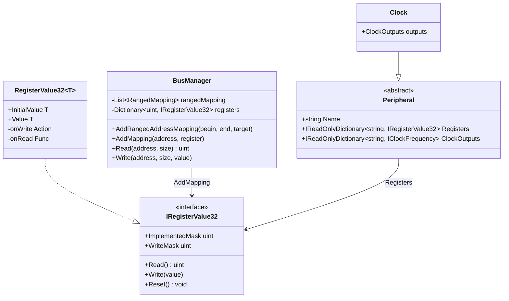
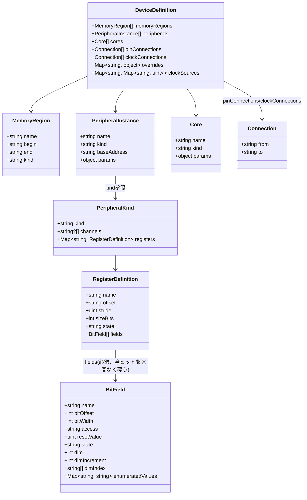

# レジスタマッピング設定ファイル 仕様書

メモリマップドな周辺モジュールを持つ CPU 向けに、周辺モジュールと CPU のメモリ空間の対応付けを外部 JSON 設定ファイルで定義するための、**ファイル形式・粒度・検証方式**の設計書です。
特定のアーキテクチャ・ベンダーに依存しない汎用スキーマとして設計する。

> **この仕様書の役割分担**
> - 設計意図・スキーマの構造・「なぜそうなっているか」→ この仕様書
> - JSON Schema の正確な定義（型・必須/任意・正規表現）→ 実装時に `schema/*.schema.json` として作成し、ここからはファイル名で参照するに留める
> - C# 側 API 詳細（シグネチャ・引数・戻り値）→ ソースコードの XML ドキュメントコメント（クラス名・メソッド名で参照するに留め、二重保守を避ける）

関連 issue: `Arcavirt-ll5`（親feature）、`Arcavirt-ll5.1`（本設計spike）、`Arcavirt-c0i`（CMSIS-SVD参考実装）。

## 背景と目的

周辺モジュールのレジスタとメモリ空間の結び付けは、対象プロジェクトの現状では C# コードに直接埋め込まれており、品種を追加するたびに C# クラスが増える。
**目的**: 「周辺モジュールの動作は C#、どのレジスタがどこに何個あるかは JSON」という分担を確定し、JSON スキーマ・ロード時検証方針を定める。

## 責務とスコープ境界

**担うこと**: 周辺モジュールのインスタンス（アドレス・個数）の外部化／レジスタのアクセス権限・初期値・実装ビットの外部化／クロック配線・割込み配線の外部化／ロード時の整合性検証。

**担わないこと（別issue）**:
- 周辺モジュール自体の動作実装（`onWrite`/`onRead` の中身）。CLOCK も含む。
- 観測性の実装方式（違反ログの出し方）。「常に警告ログを出す」ことだけ確定。
- 複数の要因が1本のベクタに集約される割込み（グループ割込み等）の**要因判定ロジックそのもの**。
  配線（どの周辺がどの集約レジスタに繋がるか）は「信号配線」で表現できるが、集約後の要因判定ロジックは C# 側の別実装が必要。
- 一部周辺モジュールのレジスタオブジェクト完成。個別の実装状況は別計画とする。

**判断基準**: 「データシートに書かれた静的な事実」なら JSON、「レジスタ間・オブジェクト間の相互作用（時間で値が変わる、他の状態を変える）」なら C#。

## スキーマの設計

### 設計方針

- 繰り返し構造（ポート・チャネル）は配列/インデックスにする
- **型とインスタンスを分離する**: `PeripheralKind`（型、全品種で共有）と`PeripheralInstance`（配置、品種ごとのアドレス表）を分ける。
  これにより汎用的なレジスタ記述を品種の数だけ重複させずに済む。

### クラス図

#### C# 側（目標形）



#### JSON 側



`DeviceDefinition`は1台のデバイス（1品種）を記述するJSONファイルのトップレベル型。
`MemoryRegion`は`memoryRegions`の各要素で、アドレス空間上の1区画（RAM/ROM/未使用領域等）を`begin`〜`end`の範囲と`kind`で表す。
`IRegisterValue32.ImplementedMask`/`WriteMask`はJSONの入力項目ではなく、
構築時に`fields`から合成される導出値（バスアクセスの高速な判定用キャッシュ）である。

### 各フィールドの説明

JSON を書く人・読む人が実装知識を持たなくても意味が分かることを最優先する。

**型表記**: 16進で読みたい値（アドレス・オフセット）は文字列（`"0x0008C000"`）、10進で十分な値（幅・個数）は素の数値（`8`）で書く。
負の値は符号を前置する（`"-0x1F"`）。
10進表記（`"-31"`のような文字列）は許容しない。

#### `PeripheralKind`

周辺モジュールの種別定義。
データシートの章1個に対応し、全品種で1回だけ書く（品種ごとの配置は`PeripheralInstance`が別途持つ）。

| フィールド | 型 | 説明 |
| --- | --- | --- |
| `kind` | string | 種別名（例: `"PORT"`）。`PeripheralInstance.kind` から参照される。 |
| `channels` | `(string \| null)[]`（任意） | 繰り返し単位の一覧。文字列＝チャネル名、`null`＝構造的な永久欠番（位置だけ消費しレジスタは生成しない。具体例は後述「完全な例」を参照）。1つしか無い種別では省略する。 |
| `registers` | `Map<string, RegisterDefinition>`（**必須**） | レジスタ名をキーとする辞書。 |

**`null` と「デバイス差分で無いチャネル」の違い**: `null` はこのマイコン種別に恒久的に存在しないことを表す。
一部デバイスにだけ無いチャネルは `channels` では文字列のまま残し、`overrides` で該当デバイスだけ `{"implemented": false}` にする。
`null` にすると名前が失われ、どのデバイスからも参照できなくなる。

#### `RegisterDefinition`（`registers` の各要素）

| フィールド | 型 | 説明 |
| --- | --- | --- |
| `name` | string(キー) | データシートのレジスタ名（例: `"CTRL"`）。 |
| `offset` | string（符号付き16進） | ブロック基準の相対オフセット。C# 側の唯一の情報源。負値も許容（`baseAddress` はアンカーレジスタの絶対アドレスのため、手前のレジスタは負になりうる。例: `"-0x1F"`）。 |
| `stride` | uint（既定 `0`） | `address(n) = baseAddress + offset + stride * n`の`n`は`channels`配列の0始まりインデックス（チャネル名の文字列とは無関係、`null`も1個としてカウント）。間隔が一定でない繰り返しには使えない（その場合は各回を別々の`PeripheralInstance`にする）。 |
| `sizeBits` | int | レジスタのビット幅（8/16/32）。 |
| `state` | `"implemented"`(既定)\|`"unimplemented"`\|`"reserved"`\|`"exception"` | 実装状況（値の意味は後述の表）。 |
| `fields` | `BitField[]`（**必須**） | ビット単位の名前付きフィールド。アクセス権・リセット値・実装状況を集約（レジスタ全体のマスクは持たない。理由は後述）。 |

#### `PeripheralInstance`

| フィールド | 型 | 説明 |
| --- | --- | --- |
| `name` | string | インスタンス名（例: `"TIMER0"`）。`overrides` パスの先頭要素。 |
| `kind` | string | `PeripheralKind.kind` への参照。 |
| `baseAddress` | string（16進） | 基準アドレス。**必ずアンカーレジスタ（実在するレジスタ）の絶対アドレスで書く**。どのレジスタをアンカーに選ぶかは任意（先頭である必要はない）だが、選んだら`registers`の`offset`は全てそのレジスタからの相対値で統一する（C構造体の先頭で書くと、モジュールによって構造体の並びが違うため偽の差分が生じる）。 |
| `params` | 任意のJSON値（任意） | `kind` 固有の設定データ。ローダーは中身を検証しない。詳細は次項。 |

#### `params`（`kind` 固有データの逃し場所）

周辺モジュール（特に割込みコントローラーのようなもの）が内部に持つデータ構造は`kind`ごとに全く異なる。
これをコアのJSONスキーマに刻むと汎用性が損なわれるため、`PeripheralInstance`に**任意のJSON値を持てる`params`フィールド**を用意し、
中身の解釈は完全にその`kind`を実装するC#クラスの責務とする（具体例は後述「信号配線」節の`IRQC`の`vectors`）。
別の`kind`を追加する場合もコア側のJSONローダーやスキーマを変更する必要はない。
この代償として、`params`の中身は自己文書化されず、その`kind`固有のドキュメントへ説明責任が切り出される。

#### `Core`

CPUコアは`name`/`kind`/`params`を持つが、バスにマップされないため`baseAddress`/`registers`は持たない別の型として定義する。

| フィールド | 型 | 説明 |
| --- | --- | --- |
| `name` | string | インスタンス名。`pinConnections`/`clockConnections`から参照される。 |
| `kind` | string | コア実装（命令実行エンジン）の選択（例: `"core-v1"`, `"core-v2"`）。 |
| `params` | 任意のJSON値（任意） | コア`kind`固有の設定（リセットベクタ・割込みベクタベース初期値等）。アーキテクチャごとに表現形式が全く異なるため、あえてコアの共通スキーマには持たせずここに含める。 |

```jsonc
{ "cores": [ { "name": "CORE0", "kind": "core-v1", "params": { /* コア固有設定 */ } } ] }
```

`DeviceDefinition`は`cores`を配列として持つ（多くはシングルコア構成だが、マルチコアSoCへの拡張を見据える）。
`pinConnections`/`clockConnections`は`peripherals[].name`と`cores[].name`の両方から名前解決されるため、両者の名前重複を禁止する。

#### `BitField`（`fields` の各要素、必須項目）

| フィールド | 型 | 説明 |
| --- | --- | --- |
| `name` | string | データシートのフィールド名（例: `"EN"`）。予約ビットは `"Reserved"`。 |
| `bitOffset` | int | レジスタ内のビット位置。デバイスごとに変わりうるため単一情報源として JSON にのみ持たせる。 |
| `bitWidth` | int | フィールドの幅（ビット数）。 |
| `access` | `"r"`\|`"w"`\|`"rw"` | 読み書き可否（`"rw"`と`"wr"`はローダーが同一視する同義表記、優先はどちらでもよい）。`"r"`のみへの書き込みは常に無視。 |
| `resetValue` | uint または `null` | リセット直後の値。`null`＝単一の固定値が定まらない（`state`ごとの意味の違いは後述）。 |
| `state` | 4値（下表） | 実装状況と、状況に反したアクセス時の挙動。 |

**`state` の4値**:

| 値 | 意味 | 読み | 書き | 違反ログ |
| --- | --- | --- | --- | --- |
| `"implemented"` | 通常通り機能する（既定） | 通常どおり | `access` に従う | 無し |
| `"unimplemented"` | 存在しない。完全に don't-care | `resetValue` | 無視 | 出さない |
| `"reserved"` | データシート上の予約ビット、または品種差でこのビット/レジスタに対応する実体が無い | `resetValue` | 無視 | `resetValue`から変化する書き込みのみ出す |
| `"exception"` | アクセス自体が実機の例外・フォルトに相当する（MPU保護領域等） | — | — | アクセス例外/割込みを要求する（発生させる責務はコア/バス実装側のC#クラスが持つ。JSON側は宣言するだけ） |

`"unimplemented"` は違反判定なしのdon't-care。
`"reserved"` は違反判定の基準値が必要なため`resetValue: null`と併用不可（ロード時エラー）。
この検証は`overrides`適用後の実効値に対して行う。
`overrides`は部分適用のため、`state`のみ`"reserved"`に変え`resetValue`を省略するエントリは種別定義側の既存値を継承する
（既存値が`null`の場合のみエラー）。

`resetValue`の役割は`state`で変わる: `"implemented"`では初期値、
`"unimplemented"`/`"reserved"`では恒久的な読み出し値、`"exception"`では不使用。

`"exception"`の適用範囲: 多くのアーキテクチャでは保護違反はレジスタ単位ではなくメモリ領域単位（MPU/MMU等）で検出されるため、
この値は主に「未実装レジスタへのアクセスがバスフォルトになる」という一般性のために用意している。

レジスタは`fields`で隙間なく覆われ（未実装・パディングビットも含む）、ロード時検証で保証する。

#### `BitField` の繰り返し圧縮記法（`dim`/`dimIncrement`/`dimIndex`）

等間隔で並ぶ同構造フィールド（`PORT.DIR`の`B0`〜`B7`等）は、既存の繰り返しフィールド圧縮記法（`dim`/`dimIncrement`/`dimIndex`）で表す。

| フィールド | 型 | 説明 |
| --- | --- | --- |
| `dim` | int（任意） | 繰り返し数。省略時は単一`BitField`として扱う。 |
| `dimIncrement` | int（`dim`指定時は必須） | 1個あたりのビット位置増分。 |
| `dimIndex` | string[]（任意） | 名前の`%s`に代入される値。連番なら省略可（既定`0`〜`dim-1`）。 |

```jsonc
{ "name": "B%s", "bitOffset": 0, "bitWidth": 1, "access": "rw", "resetValue": 0,
  "dim": 8, "dimIncrement": 1 }
```
→ `B0`(bitOffset 0)〜`B7`(bitOffset 7) が生成され、展開後は`"PORT.5.DIR.B4"`のように
個々のフィールド名で`overrides`できる。飛び番があるフィールド配列には使えない
（個々の`BitField`を明示的に列挙する）。

#### `overrides` のパス文法

`DeviceDefinition` のトップレベルに1箇所だけ持つ辞書。キーはドット区切りパス、値は
マージする差分オブジェクト。

```
{instanceName}.{channelName}                                          … チャネル全体
{instanceName}[.{channelName}].{registerName}[{index}][.{fieldName}]  … レジスタ/フィールド
```

`{index}` は`"[28]"`形式の配列レジスタ用（`channels`とは併用しない）。
`dim`展開で生成されたフィールド（例: `B4`）は`[index]`ではなく`.{fieldName}`側に書く（例: `"PORT.5.DIR.B4"`）。
`[index]`はチャネル概念を持たない均一配列レジスタ専用で、フィールドの繰り返し圧縮とは別の機構。

| 使用例 | 意味 |
| --- | --- |
| `"PORT.6"` | インスタンス`PORT`のチャネル`6`全体（`{"implemented": false}`等） |
| `"PORT.5.DIR.B4"` | インスタンス`PORT`のチャネル`5`の`DIR`レジスタの`B4`フィールド |
| `"IRQC.PRI[28]"` | インスタンス`IRQC`の`PRI[28]`（配列レジスタの1要素） |

マージは**部分適用**（指定したプロパティだけが置き換わる）。ただし種別定義に存在しない
要素を新設する場合は既存値が無いため、その型の必須プロパティをすべて指定する。
`overrides`の対象は`RegisterDefinition`（`offset`/`stride`/`sizeBits`/`state`/`fields`）と
`BitField`（`bitOffset`/`bitWidth`/`access`/`resetValue`/`state`）の
**`name`を除く全プロパティ**（`name`はキーそのものであり、上書き対象ではなくパスの
一部として使う）。レジスタ単位で`fields`プロパティ自体を指定した場合は配列を丸ごと
置き換える（個々のフィールドだけを直す場合は`.{fieldName}`パスを使う）——レジスタの
オフセットや幅が全品種で不変である保証は無く、実際に反例がある（あるレジスタの
幅が品種間で16ビットと32ビットのように変わる実例が確認されている）。

#### `BitField.enumeratedValues`（値の名前付け）

フィールドが取り得る値に名前を与える任意項目。ピン機能選択レジスタのように、値の
意味がピン固有で、かつ配線の有無がパッケージによって変わる場合に使う。

| フィールド | 型 | 説明 |
| --- | --- | --- |
| `enumeratedValues` | `Map<string, string>`（任意） | 値(16進文字列、キー)→名前(値)の辞書。全品種の和集合を`PeripheralKind`側で定義する。 |
| `enumeratedValuesOnly` | `string[]`（任意、`overrides`用） | `enumeratedValues`のキーのうち、このデバイスで有効な値の許可リスト。 |
| `enumeratedValuesExclude` | `string[]`（任意、`overrides`用） | `enumeratedValues`のキーのうち、このデバイスで無効な値の除外リスト。両方同時指定は不可。 |

```jsonc
// peripheral-kinds/pinmux.json（全品種共通）
{ "name": "SEL", "bitOffset": 0, "bitWidth": 6, "access": "rw", "resetValue": 0,
  "enumeratedValues": { "0x00": "GPIO", "0x0A": "UART_TX", "0x0D": "SPI_MOSI" } }

// devices/variant-b.json（UART_TXが配線されていない品種）
{ "overrides": { "PINMUX.P00.SEL": { "enumeratedValuesExclude": ["0x0A"] } } }
```

リストに無い値の書き込みも妨げず違反ログのみ出す（他の違反と同じ既定動作）。
`enumeratedValues`を持たないフィールドには適用しない。

### レジスタキーの束縛規約

周辺モジュールクラスは`IReadOnlyDictionary<string, IRegisterValue32> Registers`を
公開する。キーの合成規則:

- 単一レジスタ: `"CTRL"`
- チャネルを持つレジスタ: `"{channelName}.{registerName}"`（例: `"0.DIR"`）
- 均一な配列でチャネルを持たないもの（割込みコントローラーの`IER`/`PRI`等）:
  `"{registerName}[{index}]"`（JSON側は必要な index だけ列挙すればよい）

`overrides`のパスとの違い: `Registers`キーは`PeripheralInstance`内部限定のため
インスタンス名を含まない。`overrides`はファイル全体対象のためインスタンス名から
始まる。他のドット区切り構成要素は同じ。

### 全レジスタを `fields` に統一した理由

レジスタ全体のマスク属性とビット単位の`fields`を併用すると、ビット位置変更時に
片方だけ更新されて不整合が生じる事故を防げない。**単一情報源の原則**により、ビットの
意味づけはすべて`fields`に一元化し、JSONスキーマにレジスタ全体を対象にしたマスク
（`implementedMask`等の入力項目）は存在しない（C#側の`ImplementedMask`/`WriteMask`は
`fields`からの導出値であり、この原則と矛盾しない）。

予約ビットへの違反挙動の4分類は、フィールド単位の`access`/`resetValue`/`state`の
組み合わせで過不足なく表現できる:

| 分類 | `BitField` での表現 |
| --- | --- |
| 予約ビットに0/1を書け | `access:"rw"`, `state:"reserved"`, `resetValue:0`(または`1`)。違反判定は`newValue != currentValue` |
| 読み出し専用 | `access:"r"` |
| 読み値不定 | `resetValue:null`, `state:"implemented"` |
| 通常の機能フィールド | `access:"rw"`, `state:"implemented"`（既定） |

## 差分圧縮方式（品種・パッケージ差の表現）

複数品種・複数パッケージにまたがる周辺モジュールの差分を実データで調査し、8類型に
分類した。類型ごとに最小記述量になる圧縮方式が異なる。

| # | 類型 | 実例 | 圧縮方式 |
| --- | --- | --- | --- |
| 1 | インスタンス数だけ違う | 同種のタイマーが品種によって2チャネル→4チャネルに増える | テンプレート1本 + インスタンス番号の明示リスト |
| 2 | ベースアドレスだけ違う | 同じ周辺が品種によって配置アドレスだけ変わる | `baseAddress`はアンカーレジスタの絶対アドレスで定義 |
| 3 | レジスタの有無が違う | パッケージによって特定のポート群が丸ごと存在しない | チャネル単位は`overrides`で`{"implemented": false}`。インスタンス単位は`peripherals`に単に記載しない |
| 4 | ビット実装/未実装が違う | 同じレジスタでもピン数の少ないパッケージでは上位ビットが未実装 | 種別定義は全品種の和集合、パッケージ別に不要なビットを`state:"reserved"`に |
| 5 | リセット値が違う | 実測では稀 | 差が出る少数のフィールドだけ`overrides`で`resetValue`を上書き |
| 6 | レジスタ名が違う | 同じ機能のレジスタが品種によって別名になる | 別の`PeripheralKind`として独立に定義する |
| 7 | ベクタ番号だけ違う | 割込みベクタ番号の対応が品種ごとに異なる | ベクタ表は品種ごと丸ごと別ファイル |
| 8 | 列挙値だけが違う | ピン機能選択の列挙値がパッケージで変わる | `enumeratedValues` + `enumeratedValuesOnly`/`Exclude` |

### 完全な例

`peripheral-kinds/port.json`（種別定義、全チップ共通で1回だけ書く）:

```jsonc
{
  "kind": "PORT",
  "channels": ["0","1","2","3","4","5","6","7","8","9","A","B","C","D","E","F","G", null, "J"],
  "registers": {
    "DIR": { "offset": "0x00", "stride": 1, "sizeBits": 8,
      "fields": [
        { "name": "B%s", "bitOffset": 0, "bitWidth": 1, "access": "rw", "resetValue": 0,
          "dim": 8, "dimIncrement": 1 }
      ] }
  }
}
```

`channels`の`null`（17番め、`H`欠番）も位置としてカウントされるため、`G`は位置16、
`J`は位置18（`address = baseAddress + offset + 18 * stride`）。C#側`Registers`辞書には
`"0.DIR"`〜`"G.DIR"`, `"J.DIR"`のキーが作られる。

`devices/board-a.json`（インスタンス定義 + パッケージ差分。型1・3・4の複合）:

```jsonc
{
  "peripherals": [
    { "name": "PORT", "kind": "PORT", "baseAddress": "0x0008C000" }
  ],
  "overrides": {
    "PORT.5.DIR.B4": { "state": "reserved" },
    "PORT.5.DIR.B5": { "state": "reserved" },
    "PORT.5.DIR.B6": { "state": "reserved" },
    "PORT.5.DIR.B7": { "state": "reserved" }
  }
}
```

（ピン数の少ないパッケージでは、対応するポートビットが存在しないことがある。データ
シートが「存在しないビットは予約ビットであり読みは0、書き込みは0であるべき」と
明記していれば`"unimplemented"`ではなく違反判定のある`"reserved"`を使う。ポート自体が
丸ごと消える場合は `"overrides": { "PORT.6": { "implemented": false } }` と書く。）

### ビットフィールドの並び替えにも対応する

同一レジスタ内でフィールドのビット位置自体が品種間で入れ替わる場合（`C`/`D`と`E`/`F`が
入れ替わり`G`が消えて`J`が新設、等）も、`overrides`が`BitField`単位で
`bitOffset`/`bitWidth`/`state`を上書きできるため表現できる。マスクでは「どのビットが
有効か」は表現できても「そのビットが何という名前のフィールドか」を追跡できないため、
これは全レジスタを`fields`に統一したことで初めて解けた問題である。

```jsonc
{ "overrides": {
    "EXAMPLE0.CR.C": { "bitOffset": 3 }, "EXAMPLE0.CR.D": { "bitOffset": 2 },
    "EXAMPLE0.CR.E": { "bitOffset": 5 }, "EXAMPLE0.CR.F": { "bitOffset": 4 },
    "EXAMPLE0.CR.G": { "state": "unimplemented" },
    "EXAMPLE0.CR.J": { "bitOffset": 0, "bitWidth": 1 }
  } }
```

フィールドの意味・振る舞いはチップ非依存のC#ロジックのまま、ビット位置だけをJSONから
供給する構成になる。

## クロックの扱い

`CLOCK`は他の周辺モジュールと同格の1つで、クロック制御レジスタへの書き込みを受けて
周波数を再計算し依存オブジェクトへ伝える動的な振る舞いを持つため、C#で実装する
（責務とスコープ境界の判断基準そのもの）。**配線の記法（`clockConnections`/
`clockSources`、`ClockOutputs`という名前付き辞書）は汎用、`CLOCK`クラス自身
（分周比の計算式）はチップ固有**という分離のため、C#実装にしても汎用性は失われない。
対応アーキテクチャを追加する場合は、そのチップ用のクロック計算クラスを実装し、同じ
`ClockOutputs`規約に従わせればよい。

### `clockSources`: 名前付きクロック源の宣言

外部発振子やチップ内蔵発振器など、他のクロックから供給を受けずレジスタも持たない
クロック源を宣言する。

```jsonc
{ "clockSources": {
    "osc": { "MAIN": 12000000, "SUB": 32768 }
} }
```

`namespace`(グループ名)→クロック源名→初期周波数(Hz)の2階層の辞書。値はHzの数値
そのもの（キーの位置が既に何の値かを語っている）。周波数の省略は不可（「未設定」は
`0`を明示する）。`namespace`はグローバル予約語ではなく、`PeripheralInstance.name`と
衝突しないようデバイスごとに自由に選ぶ。「外部ピン」と「内蔵発振器」を区別する専用
フラグは持たせない（C#側では最終的にどちらも同じ`MainClock`になるため）。

### `clockConnections`: 配線の宣言

```
clockConnections := { "from": <path>, "to": <path> }[]
path              := "<sourceName>.<pinKey>"
sourceName        := <clockSourcesのnamespaceキー> | <PeripheralInstance.name>
```

`from`は最初のセグメントが`clockSources`のnamespaceと一致すればそこから、しなければ
`PeripheralInstance`の`ClockOutputs`から名前解決する。`to`の`pinKey`は消費側の
コンストラクタ引数名。1つの`to`は1つの`from`からしか給電されない（ファンイン禁止、
ロード時検証）。分周回路やチップ間の多段構成も、分周回路自身を`PeripheralInstance`と
してモデル化し2本の`Connection`で繋げば表現できる。

```jsonc
{ "clockConnections": [
    { "from": "osc.MAIN", "to": "CLOCK.mainOsc" },
    { "from": "CLOCK.PCLK", "to": "TIMER0.clkIn" }
] }
```

分周比が実行時に変わる値（`TIMER`の`SubClock`など）は固定Hzを記述できない。ローダーは
`from`が指す**生きたオブジェクト**（`IClockFrequency`）を取得し
`new TIMER(..., clkIn: resolved)`のように渡す。JSONは参照先の名前だけを記述し、値の
計算は供給元クラスの内部実装に委ねる。

ローダーは`clockSources`を根とする有向グラフを`clockConnections`からトポロジカル
ソートして構築順を決める（`peripherals`の記載順は依存関係を表さない）。循環参照は
ロード時エラーとする（`IClockFrequency`は循環を想定しない設計のため）。

モジュール自身が持つプリスケーラ（`TIMER`内部の分周設定レジスタ等）はこの配線に含めない。
境界は「モジュール外部から入力される信号か、内部でさらに加工されるか」。

## 信号配線（`pinConnections`）

割込み要求・周辺間トリガ・GPIOのような1ビット信号の配線は、すべて`pinConnections`
という1つの汎用配列で表現する。周辺モジュール→割込みコントローラー→CPUコアという
経路を、特定の割込みコントローラー以外でも記述できる形にする。クロックと同じ方針で、
**配線は宣言的なJSON、コントローラー固有のロジックはC#実装**に持たせる。コアとなる
JSONスキーマには、ベクタ番号・優先度・グループ割込みといった特定コントローラーの
概念を一切持たせない（それらは`params`に逃がす。「スキーマの設計」の`params`節を
参照）。文法は`clockConnections`と同じ`{from, to}`形だが、運ぶものが違うため別の
配列にする。

```
pinConnections := { "from": <pinPath>, "to": <pinPath> }[]
pinPath        := "<instanceName>.<pinKey>"
pinKey         := <pinName> | "<channelName>.<pinName>"
```

`instanceName`は`peripherals[].name`または`cores[].name`のいずれか。`pinKey`はその
インスタンスの`kind`を実装するC#クラスが公開する入出力ピン名で、**JSONにはピン名の
一覧を宣言しない**（`ClockOutputs`と同じ立場。ローダーが構築後のインスタンスに
対して実在確認する）。

```jsonc
{
  "peripherals": [
    { "name": "IRQC", "kind": "IRQC", "baseAddress": "0x00087000",
      "params": { "vectors": [ { "number": 24, "priority": 24 } ] } },
    { "name": "TIMER0", "kind": "TIMER", "baseAddress": "0x00088002" },
    { "name": "TIMER1", "kind": "TIMER", "baseAddress": "0x000C2000" },
    { "name": "ADC0", "kind": "ADC", "baseAddress": "0x00089000" }
  ],
  "cores": [ { "name": "CORE0", "kind": "core-v1" } ],
  "pinConnections": [
    { "from": "TIMER0.0.cmpMatch", "to": "IRQC.24" },
    { "from": "IRQC.coreIrq",      "to": "CORE0.irq" },
    { "from": "TIMER1.compareA",   "to": "ADC0.trgIn" }
  ]
}
```

この例だけで、周辺→コントローラー→CPUコア、周辺→周辺という2種類の経路が、どちらも
同じ`pinConnections`だけで表現できることが分かる。

**ファンアウト**（1つの比較一致がADCトリガと別モジュールの起動を兼ねる等、複数宛先への
分岐）は実機に実在するため許可する（同じ`from`を複数書けばよい）。**ファンイン**
（複数出力が同じ宛先を指す）は集約レジスタを経由しない限り物理的に矛盾するため
ロード時エラーとする。集約したい場合は、コントローラー側に別々の入力ピン名
（グループレジスタの各ビットに対応する名前）を用意し、そこを経由させる。

## ロード時検証

以下はすべて`overrides`適用後の実効スキーマ（デバイスごとに解決済みの最終形）に対して行う。

| # | 検証内容 | 根拠 |
| --- | --- | --- |
| 1 | 同一アドレスへの重複登録を検出しエラーにする | 検出しないと後勝ちで黙って上書きされ、実アドレス数が水面下で減る |
| 2 | 範囲マッピングで `begin > end` を検出しエラーにする | `Lancher/Program.cs:27` の実バグ |
| 3 | `PeripheralInstance` 構築後の C# `Registers` 辞書と、JSON から生成されるはずのキー集合との双方向差分チェック | 記載漏れ・typo対策 |
| 4 | `overrides` で新設・移動した `BitField` が、そのデバイスでの実効 `sizeBits` を超えていないか | 差分圧縮方式の設計前提の保護 |
| 5 | `clockConnections[].from`/`to` が `clockSources` または実在する `PeripheralInstance` の `ClockOutputs`/コンストラクタ引数名に解決できるか | 配線宣言の整合性チェック |
| 6 | `state:"reserved"` の `BitField` が `resetValue:null` になっていないか | 判定基準が無い「予約」は無意味（`"unimplemented"` を使うべき） |
| 7 | `clockSources` の `namespace`/クロック源名、`PeripheralInstance`/`Core` の `name` にドット文字を含めることを禁止する | 配線先パスのドット区切り解決が曖昧にならないようにするため |
| 8 | `clockSources` の `namespace` キーが、同じデバイス内の `PeripheralInstance`/`Core` の `name` と一致していないか | 一致すると `clockConnections` の先頭セグメントが曖昧になる |
| 9 | `clockConnections` の参照関係が構成する有向グラフに循環が無いか | `IClockFrequency` は循環参照を想定しない設計 |
| 10 | `enumeratedValuesOnly`/`enumeratedValuesExclude` が同一 `BitField` に同時指定されていないか、参照キーが実在するか | typo・二重指定の検出 |
| 11 | `fields` が `sizeBits` の範囲を隙間なく・重複なく覆っているか | 全ビットがどれかの `BitField` に属することを保証する |
| 12 | `overrides` が `RegisterDefinition` の `offset`/`stride`/`sizeBits` を変更する場合、`BitField` 単位の上書きより目立つ警告を出す | 構造的に重大な差分をレビューしやすくするため |
| 13 | `pinConnections[].from`/`to` の `instanceName` が実在し、`pinKey` が構築後のインスタンスが実際に公開する出力ピン(`from`)/入力ピン(`to`)と一致するか | 方向を取り違えた配線を検出する |
| 14 | 同一の `to` を持つ `pinConnections` が複数存在しないか（ファンイン禁止） | 集約したい場合は別々の入力ピン名を経由させる |
| 15 | `clockConnections[].to` の `pinKey` が、対象の `kind` が実際に受け付けるクロック入力引数名と一致するか | 項目13と対になる検証 |
| 16 | `PeripheralInstance.name` と `Core.name` が重複していないか | 配線の名前解決が曖昧にならないようにするため |

**`params`の中身はコア側のローダーでは検証しない**。その`kind`を実装するC#クラスが
構築時に自分で検証する責務を持つ（例: 割込みベクタの重複検出は割込みコントローラー
実装自身の責務）。

## 実機準拠の既定動作（違反アクセス時）

多くのアーキテクチャで共通する、違反アクセス時の既定動作を定める。
**「違反 = CPUに例外/割込みを上げる」は保護機構（MPU/MMU等）経由の場合を除き
一般的ではない**。下表はCPU/レジスタから見える動作のみを表し、いずれの事象も違反の
たびに毎回警告ログを出力する（ログ出力の有無とは独立した軸）。

| 事象 | 既定動作 |
| --- | --- |
| read-onlyへの書き込み | 何もしない（値は変化しない） |
| 予約/未実装ビットへの指定外値 | 保持しない。CPU状態は変えない |
| 「読み値不定」ビットの読み | 任意値（0が既定） |
| 未マップSFRアドレス | 読み: 0 / 書き: 無視。例外・割込みは上げない |
| 保護外領域への特定のバスアクセス条件 | バスエラー割込みを要求する実装を持つアーキテクチャもある（別実装） |
| モジュールストップ中のアクセス | 読み: 0 / 書き: 無視 |
| 保護違反（MPU/MMU等、ユーザモード時） | アクセス例外を発生させる（唯一の例外発生源） |

## 実装状況の既知の未了点

この仕様書はスキーマ設計を定めるものであり、対象周辺モジュールの網羅的な実装状況を
追跡するものではない。

| 項目 | 内容 |
| --- | --- |
| 観測性の実装方式 | 「常に警告ログを出す」ことは確定。ログの実装方式（source generator採用等）はJSONスキーマに影響しないため別issue。 |
| 複数ファイル構成 | `peripheral-kinds/*.json`と`devices/*.json`をどう指定し合成してロードするか（ファイル探索規約・`overrides`の優先順位）は未確定。上記の例はファイル分割の設計意図を示すための例示にすぎない。 |
