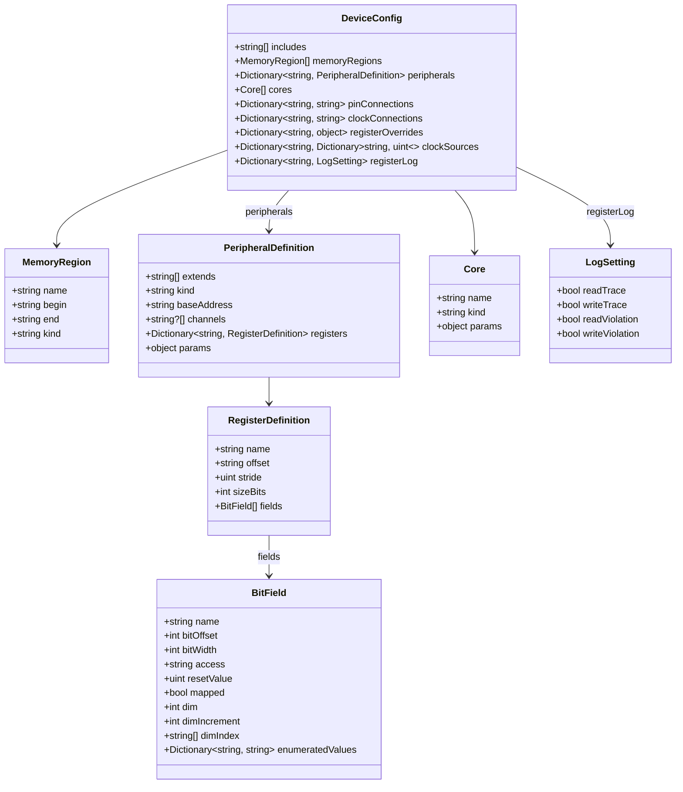
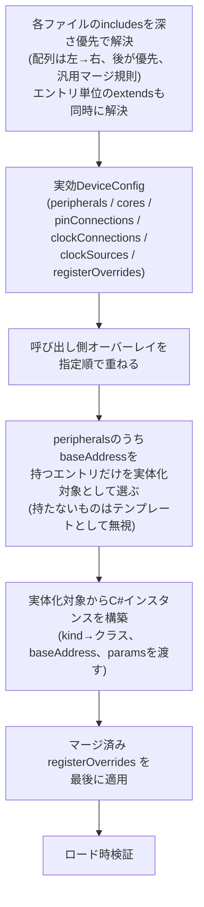

# レジスタマッピング設定ファイル 仕様書

メモリマップドな周辺モジュールを持つ CPU 向けに、周辺モジュールと CPU のメモリ空間の
対応付けを外部 JSON 設定ファイルで定義するための、**ファイル形式・粒度・検証方式**の
設計書です。特定のアーキテクチャ・ベンダーに依存しない汎用スキーマとして設計する。

> **この仕様書の役割分担**
> - 設計意図・スキーマの構造・「なぜそうなっているか」→ この仕様書
> - JSON Schema の正確な定義(型・必須/任意・正規表現)→ 実装時に `schema/*.schema.json`
>   として作成し、ここからはファイル名で参照するに留める
> - C# 側 API 詳細(シグネチャ・引数・戻り値)→ ソースコードの XML ドキュメントコメント
>   (クラス名・メソッド名で参照するに留め、二重保守を避ける)

関連 issue: `Arcavirt-ll5`(親feature)、`Arcavirt-ll5.1`(本設計spike)、
`Arcavirt-c0i`(CMSIS-SVD参考実装)。

## 対象読者とこの仕様書の読み方

この仕様書は2種類の読者を想定する。

- **設定ファイルの作成者**: 新しいデバイス・品種を Arcavirt でエミュレートするために、
  この JSON を新規に書く人。データシートを見ながら、各フィールドの意味・書式・
  既定値を調べる。
- **実装者**: この JSON をロード・解釈する C# コードを実装・保守する人。
  各フィールドの解決規則・検証内容を調べる。

この2種類の読者を文書の前半/後半で分けることはしない。各フィールドの説明は
「書式」「意味」に加え、該当する場合のみ「解決規則・既定値」「例」を持つ。
1つの項目を引けば、利用者・実装者の両方が必要な情報にたどり着ける。

- **書式**・**意味**: すべての項目に必ず記載する。
- **解決規則・既定値**: 省略可能で既定動作がある、複数の入力源(`includes`間・
  `extends`チェーン・`registerOverrides`)がマージ/上書きされる、文字列がパターンとして
  解釈される、のいずれかに該当する項目にのみ記載する。
- **例**: ネスト構造や複数フィールドの組み合わせで初めて意味を持つ、文章だけでは
  組み立て方が伝わりにくい、のいずれかに該当する項目にのみ記載する。1項目につき
  JSON例は1つまで。

見出しは、JSON のフィールド名 1 つにつき 1 つ割り当てる。個別には意味を持たない
一組のフィールド(`dim`/`dimIncrement`/`dimIndex`等)だけは、まとめて1つの見出しにする。
表は同じ属性を複数項目で比較するとき(クラスのフィールド一覧、`access`の取りうる値の
一覧等)に使う。箇条書きは順不同で2〜5個の並列項目に使い、入れ子にはしない
(内容が深くなったら見出しに昇格させる)。

## 責務とスコープ境界

**担うこと**: 周辺モジュールのインスタンス(アドレス・個数)の外部化/レジスタの
アクセス権限・初期値・実装ビットの外部化/クロック配線・割込み配線の外部化/
ロード時の整合性検証。

**担わないこと(別issue)**:
- 周辺モジュール自体の動作実装(`onWrite`/`onRead` の中身)。CLOCK も含む。
- 観測性の実装方式(ログの出力先・フォーマット等)。既定では何も出力せず、
  デバッグオーバーレイの `registerLog` で明示的に指定した場合のみログを出す。
- 複数の要因が1本のベクタに集約される割込み(グループ割込み等)の
  **要因判定ロジックそのもの**。配線(どの周辺がどの集約レジスタに繋がるか)は
  `pinConnections` で表現できるが、集約後の要因判定ロジックは C# 側の別実装が必要。
- 一部周辺モジュールのレジスタオブジェクト完成。個別の実装状況は別計画とする。

**判断基準**: 「データシートに書かれた静的な事実」なら JSON、「レジスタ間・
オブジェクト間の相互作用(時間で値が変わる、他の状態を変える)」なら C#。

## スキーマ設計方針

- 繰り返し構造(ポート・チャネル)は配列/インデックスにする。
- **定義は`peripherals`1箇所に統一する**: インスタンス名をキーにした辞書とし、
  `kind`でC#クラスに対応付け、`baseAddress`を持つエントリだけを実体化する
  (`baseAddress`を持たないエントリはテンプレートとして扱う)。同じC#クラスの
  複数インスタンスは`extends`、近縁チップ間で共通する定義は`includes`による
  テンプレート共有で重複させずに済む(詳細は`DeviceConfig`章の
  「合成と上書きの解決」を参照)。

## 全体構造

1つの JSON ファイルが持つ静的なフィールド構成を示す。



`DeviceConfig`は1つのJSONファイルのトップレベル型。`includes`/`extends`解決・
オーバーレイ適用・`registerOverrides`適用を経て得られる実効`DeviceConfig`が、
1台のデバイス(1品種)の定義になる(解決手順は「合成と上書きの解決」を参照)。

## `null`の2つの意味

この仕様書全体で繰り返し登場するため、ここで一度だけ定義する。個別の章では
この定義への言及に留め、繰り返さない。

| 意味 | 対象 | 詳細 |
| --- | --- | --- |
| マップのキー削除 | `peripherals`/`pinConnections`/`clockConnections`/`clockSources`/`registerOverrides`のような「マップ」として扱うフィールド全般。複数ファイルのマージ時、高優先度側の値が`null`ならそのキー自体を削除する | 「合成と上書きの解決」のマージ規則を参照 |
| 構造的な永久欠番 | `channels`配列内の要素としての`null`。位置だけ消費しレジスタを生成しない(マップのキー削除とは別の意味) | `peripherals`を参照 |

## 数値リテラルの記法

16進で読みたい値(アドレス・オフセット)は文字列(`"0x0008C000"`)、10進で十分な値
(幅・個数)は素の数値(`8`)で書く。負の値は符号を前置する(`"-0x1F"`)。
10進表記(`"-31"`のような文字列)は許容しない。

# DeviceConfig

JSONファイルのトップレベル型。フィールドの型は「全体構造」のC#クラス定義を、詳細は
以下の各節を参照。

## `includes`

**書式**: 自分自身のファイルの場所からの相対パスの配列(`string[]`、任意)。

**意味**: 近縁チップ間で共通する定義や、パッケージ間の共通部分を、複数ファイルに
またがって恒久的に再利用するための仕組み。実行のたびに変わらない、コミットされる
系譜を表す(実行のたびに呼び出し側が指定する一時的な追加層とは区別する。後者は
「呼び出し側によるオーバーレイ」を参照)。

**解決規則**:
1. 配列の先頭から順にマージする(後の要素が優先)。
2. 各親ファイルも自身の`includes`を持ちうる(再帰的に解決する。深さの制限は無い)。
3. 親チェーンをすべてマージした結果の上に、自分自身の内容(`registerOverrides`を
   含む)を最後に重ねる。
4. 循環参照はロード時エラーとする。
5. マージの詳細な規則は「合成と上書きの解決」の「マージ規則」を参照。

ファイル単位の`includes`と同じマージアルゴリズムを、`peripherals`の1エントリ単位では
`extends`という別名で使える(`peripherals`の`extends`を参照)。

**例**:

```jsonc
// devices/board-a-base.json(共通部分。単体では未完成でもよい)
{
  "peripherals": { "PORT": { "baseAddress": "0x0008C000" } },
  "cores": [ { "name": "CORE0", "kind": "core-v1" } ]
}
```

```jsonc
// devices/board-a-100pin.json(パッケージ差分だけを書く)
{
  "includes": ["board-a-base.json"],
  "registerOverrides": { "PORT.5.DIR.B4": { "mapped": false } }
}
```

## 合成と上書きの解決

複数ファイル・複数層にまたがる内容が、どの順序で1つの実効`DeviceConfig`に
まとまるかを定める。以下のような要求に対応する。

- 同一チップのパッケージ差分(176pin/145pin/100pinなど)を、共通部分を1本の
  ベースファイルにまとめ、パッケージごとの差分だけを別ファイルに書きたい。
- 近縁チップ間(RX64M/RX621など)で共通する周辺モジュール定義をベースにしつつ、
  品種固有の追加レジスタだけを差分ファイルに書きたい。
- テスト/CI専用の設定を、本番用のdevice定義には決して混ざらない形で、実行のときだけ
  追加したい(`registerLog`によるデバッグ用ログ設定はこの典型例)。
- 同じC#クラス(`kind`)を使う複数のインスタンス(`TIMER0`/`TIMER1`等)を、
  レジスタ定義を重複させずに作りたい。

最初の3つは「このファイルは本質的にどのファイルの派生か」という**恒久的で
コミットされる系譜**であり、実行するたびに変わってはならない(`includes`/`extends`が
担う)。テスト/CI専用の設定は逆に、**実行のたびに呼び出し側が指定する一時的な
追加層**であるべきで、device定義ファイル自身に書き込むと本番実行にも意図せず
混ざる事故のもとになる(呼び出し側オーバーレイが担う)。

### 解決フロー



1. `includes`/`extends`チェーンを深さ優先で解決する(ファイル単位・エントリ単位とも、
   配列は左から右へ順にマージ、後の要素が優先、「マージ規則」の規則を再帰適用)。
2. 呼び出し側オーバーレイを、指定された順でさらに重ねる(同じマージ規則)。
3. `peripherals`の各エントリのうち`baseAddress`を持つものだけを実体化対象として
   選び出す(持たないものはテンプレートとして無視する)。
4. 実体化対象それぞれについて、`kind`が指すC#クラスを`baseAddress`へ構築する
   (`params`はコンストラクタへ渡す)。
5. マージ済み`registerOverrides`辞書を、ステップ4で構築したインスタンス群に**最後に**
   適用する(パス単位の部分適用)。
6. ロード時検証(各フィールドの「解決規則」に記載した検証項目)を実行する。

`registerOverrides`は常にステップ5、つまりすべてのファイル・オーバーレイがマージされた
**後**に効く。個々のファイルが持つ`registerOverrides`同士は、ステップ1・2のマージ規則で
先に1つの辞書へ統合されてから、ステップ5でまとめて適用される。そのため、`extends`で
複数インスタンス化されたテンプレート(`TIMER0`/`TIMER1`等)を`registerOverrides`で
狙う場合、パスの先頭セグメントは継承元テンプレート名ではなく**実体化された
インスタンス名**を使う(`registerLog`のパスも同じ規則に従う)。

### マージ規則

`includes`・`peripherals`の`extends`・`registerOverrides`・呼び出し側オーバーレイの
すべてに、次の1つの規則を共通して適用する。

| 対象 | 規則 |
| --- | --- |
| オブジェクトの各キー | 双方に存在し両方ともオブジェクトなら再帰的にマージ。片方が配列/スカラーなら後勝ちで丸ごと置き換え |
| 片方にしか無いキー | そのまま採用 |
| 高優先度側の値が`null` | そのキー自体を削除する(「`null`の2つの意味」を参照) |
| `registerOverrides`辞書同士 | パス文字列をキーとみなし、上記と同じ規則でマージする(同じパスの差分同士も部分マージされる) |

`peripherals`の同名エントリが複数ファイルから読み込まれた場合も、この規則に従って
単純に後勝ちでマージされる(特別な衝突検出は行わない)。`registers`内の`fields`
(`BitField[]`)がこの規則の対象になる場合、配列は丸ごと置換になるため、フィールド
1個だけを名前で狙い撃ちして書き換えることはできない。これが`registerOverrides`の
ドットパス指定を廃止できない理由である(`registerOverrides`を参照)。

**循環検出**: `includes`/`extends`チェーン(ファイル単位・エントリ単位とも)に循環が
無いことをロード時に検証する。循環を想定しない解決アルゴリズムを保護するため。

### 呼び出し側によるオーバーレイ

テスト/CI専用の差分のように、恒久的な系譜には含めたくない一時的な追加層は、
`includes`/`extends`ではなく呼び出し側(ローダーAPI/CLI)が実行のたびに指定する。
`includes`/`extends`チェーンを解決して得られた実効`DeviceConfig`の上に、指定された
順序でオーバーレイファイルを同じマージ規則でさらに重ねる。オーバーレイファイル自体は
通常の`DeviceConfig`と同じ形式(多くの場合`registerOverrides`のみを持つ最小構成に
なる)。具体的な指定方法(CLI引数名・APIシグネチャ)は本書のスコープ外とし、
実装時に決定する。

### 実効JSONの出力(デバッグ用要件)

ローダーは、上記フローを実行して得られる実効`DeviceConfig`(特にステップ2の
オーバーレイ適用後・ステップ6の検証完了後の状態)を、そのままJSONとして出力できる
インターフェースを持つこと。`includes`・`extends`・オーバーレイ・`registerOverrides`が
絡み合った結果が意図通りかを、実装を介さず目視確認するために必須とする。具体的な
提供形式(CLI引数・API等)は実装時に決定する。

### 差分圧縮方式(品種・パッケージ差の早見表)

複数品種・複数パッケージにまたがる周辺モジュールの差分を実データで調査し、8類型に
分類した。類型ごとに最小記述量になる圧縮方式が異なる。「自分が今表現したい差分が
どの型か」から使う仕組みへたどり着くための索引として使う。

| # | 類型 | 実例 | 圧縮方式 |
| --- | --- | --- | --- |
| 1 | インスタンス数だけ違う | 同種のタイマーが品種によって2チャネル→4チャネルに増える | `baseAddress`を持たないテンプレート1本 + 各インスタンスがそれを`extends`する |
| 2 | ベースアドレスだけ違う | 同じ周辺が品種によって配置アドレスだけ変わる | `baseAddress`はアンカーレジスタの絶対アドレスで定義 |
| 3 | レジスタの有無が違う | パッケージによって特定のポート群が丸ごと存在しない | チャネル単位は`registerOverrides`で`{"mapped": false}`。インスタンス単位は、新規に`includes`する側では`baseAddress`を書かない(テンプレートのまま実体化しない)。`includes`元で既に`baseAddress`を持つ場合は、そのキーを`null`にしてエントリごと削除する(配線が絡む場合は`pinConnections`/`clockConnections`側の該当`to`キーも`null`にする) |
| 4 | ビット実装/未実装が違う | 同じレジスタでもピン数の少ないパッケージでは上位ビットが未実装 | `registerOverrides`の`mapped`(`false`)を使う |
| 5 | リセット値が違う | 実測では稀 | `registerOverrides`の`resetValue`を使う |
| 6 | レジスタ名が違う | 同じ機能のレジスタが品種によって別名になる | `extends`で共有せず、別の`peripherals`エントリとして独立に定義する |
| 7 | ベクタ番号だけ違う | 割込みベクタ番号の対応が品種ごとに異なる | ベクタ表は品種ごと丸ごと別ファイル |
| 8 | 列挙値だけが違う | ピン機能選択の列挙値がパッケージで変わる | `registerOverrides`の`enumeratedValuesOnly`/`enumeratedValuesExclude`を使う |

## `memoryRegions`

**書式**: `MemoryRegion`の配列(`MemoryRegion[]`)。

**意味**: アドレス空間上の区画(RAM/ROM/未使用領域等)を宣言する。各フィールドの詳細は
`MemoryRegion`を参照。

## `peripherals`

**書式**: インスタンス名をキーとする`PeripheralDefinition`の辞書
(`Map<string, PeripheralDefinition>`)。

**意味**: 周辺モジュールのインスタンスを宣言する。実体化・削除の規則、名前重複の
禁止は`PeripheralDefinition`を参照。

## `cores`

**書式**: `Core`の配列(`Core[]`)。

**意味**: CPUコアを宣言する。多くはシングルコア構成だが、マルチコアSoCへの拡張を
見据えて配列で持つ。各フィールドの詳細は`Core`を参照。

## 配線の共通規約

`pinConnections`と`clockConnections`はどちらも同じ形の宣言的なマップ
(`Map<toPath, fromPath | null>`。キー=配線先、値=配線元)で表現し、以下の規則を
共有する。

- `to`/`from`のパスは、実体化された`peripherals`のインスタンス名、または
  `cores[].name`から名前解決される。パス末尾のピン/引数名は、対象の`kind`を実装する
  C#クラスが公開する名前と一致する必要があり、**JSONにはピン名の一覧を宣言しない**
  (ローダーが構築後のインスタンスに対して実在確認する)。
- 値`null`は「この入力には意図的に何も接続しない」ことを明示する(「`null`の
  2つの意味」の「マップのキー削除」とは別の用法。配線先に何も繋がないという
  設定そのものであり、キーは残る)。
- **ファンアウト**(1つの出力が複数の`to`キーに配線される)は許可する。
  **ファンイン**(複数の出力が同じ`to`キーを指す)は、`to`をキーにしたマップ構造上
  そもそも表現できない。集約したい場合は、集約先のコントローラー/クロック側に
  別々の入力名を用意し、そこを経由させる。

**循環検出**: 同一ファイル内で同じ`to`キーを2回記述した場合、JSON構文としては
後勝ちで1つに潰れるため、単純な重複記述ミスを検出するには生のプロパティ列から
検出する実装上の配慮が必要になる(`includes`・オーバーレイ層をまたいだ`to`キーの
重複は意図的な上書きであり、検出対象ではない)。

固有の意味づけ(周波数の扱い・トポロジカルソート・`params`の使い方等)は
`clockSources`・`clockConnections`・`pinConnections`それぞれの節で説明する。

## `pinConnections`

**書式**: `Map<toPinPath, fromPinPath | null>`。

```
pinPath := "<instanceName>.<pinKey>"
pinKey  := <pinName> | "<channelName>.<pinName>"
```

**意味**: 割込み要求・周辺間トリガ・GPIOのような1ビット信号の配線を、1つの汎用マップで
表現する。周辺モジュール→割込みコントローラー→CPUコアという経路を、特定の
割込みコントローラー以外でも記述できる形にする。コアとなるJSONスキーマには、ベクタ
番号・優先度・グループ割込みといった特定コントローラーの概念を一切持たせない
(それらは`params`に逃がす)。マップの一般的な構造・`null`の意味・
ファンアウト/ファンインの扱いは「配線の共通規約」を参照。

**解決規則**: `instanceName`は実体化された`peripherals`のキー、または`cores[].name`の
いずれか。各エントリの`instanceName`が実在し、`pinKey`が構築後のインスタンスが
実際に公開する出力ピン(`from`側)/入力ピン(`to`側)と一致することをロード時に検証する
(値が`null`のエントリは検証対象外)。同一ファイル内での`to`キー重複の扱いは
「配線の共通規約」を参照。

**例**:

```jsonc
{
  "peripherals": {
    "IRQC": { "kind": "IRQC", "baseAddress": "0x00087000",
      "params": { "vectors": [ { "number": 24, "priority": 24 } ] } },
    "TIMER0": { "kind": "TIMER", "baseAddress": "0x00088002" },
    "ADC0": { "kind": "ADC", "baseAddress": "0x00089000" }
  },
  "cores": [ { "name": "CORE0", "kind": "core-v1" } ],
  "pinConnections": {
    "IRQC.24": "TIMER0.0.cmpMatch",
    "CORE0.irq": "IRQC.coreIrq",
    "ADC0.trgIn": "TIMER0.compareA"
  }
}
```

この例だけで、周辺→コントローラー→CPUコア、周辺→周辺という2種類の経路が、どちらも
同じ`pinConnections`だけで表現できることが分かる。継承した配線を品種差分で
無効化したい場合(モジュール丸ごと不在のパッケージ等)は、`peripherals`の該当エントリと
`pinConnections`の該当`to`キーの両方を`null`にする。

## `clockConnections`

**書式**: `Map<toPath, fromPath | null>`。

```
toPath     := "<consumerName>.<pinKey>"   // pinKeyは消費側のコンストラクタ引数名
fromPath   := "<sourceName>.<pinKey>"
sourceName := <clockSourcesのnamespaceキー> | <実体化された peripherals のインスタンス名>
```

**意味**: `CLOCK`は他の周辺モジュールと同格の1つで、クロック制御レジスタへの書き込みを
受けて周波数を再計算し依存オブジェクトへ伝える動的な振る舞いを持つため、C#で実装する。
配線の記法自体は汎用、`CLOCK`クラス自身(分周比の計算式)はチップ固有という分離のため、
C#実装にしても汎用性は失われない。マップの一般的な構造・`null`の意味・
ファンアウト/ファンインの扱いは「配線の共通規約」を参照。

**解決規則**: `from`は最初のセグメントが`clockSources`のnamespaceと一致すればそこから、
しなければ実体化されたインスタンスの`ClockOutputs`から名前解決する。分周比が実行時に
変わる値(`TIMER`の`SubClock`など)は固定Hzを記述できないため、ローダーは`from`が指す
**生きたオブジェクト**(`IClockFrequency`)を取得し供給する。JSONは参照先の名前だけを
記述し、値の計算は供給元クラスの内部実装に委ねる。ローダーは`clockSources`を根とする
有向グラフを`clockConnections`からトポロジカルソートして構築順を決める(`peripherals`の
記載順は依存関係を表さない)。循環参照はロード時エラーとする。各エントリの`to`の
`pinKey`が、対象の`kind`が実際に受け付けるクロック入力引数名と一致することも
ロード時に検証する。

モジュール自身が持つプリスケーラ(`TIMER`内部の分周設定レジスタ等)はこの配線に
含めない。境界は「モジュール外部から入力される信号か、内部でさらに加工されるか」。

**例**:

```jsonc
{ "clockConnections": {
    "CLOCK.mainOsc": "osc.MAIN",
    "TIMER0.clkIn": "CLOCK.PCLK"
} }
```

## `clockSources`

**書式**: `Map<namespace, Map<sourceName, uint>>`。

```jsonc
{ "clockSources": {
    "osc": { "MAIN": 12000000, "SUB": 32768 }
} }
```

**意味**: 外部発振子やチップ内蔵発振器など、他のクロックから供給を受けずレジスタも
持たないクロック源を宣言する。`namespace`(グループ名)→クロック源名→初期周波数(Hz)の
2階層の辞書。値はHzの数値そのもの(キーの位置が既に何の値かを語っている)。周波数の
省略は不可(「未設定」は`0`を明示する)。`namespace`はグローバル予約語ではなく、
実体化された`peripherals`のインスタンス名と衝突しないようデバイスごとに自由に選ぶ。
「外部ピン」と「内蔵発振器」を区別する専用フラグは持たせない(C#側では最終的に
どちらも同じ`MainClock`になるため)。

**解決規則**: 複数ファイルにまたがる`clockSources`は、「合成と上書きの解決」の
マージ規則が2階層にそのまま適用される。異なる`namespace`同士・同じ`namespace`内の
異なるクロック源名同士は和集合になり、同じ`namespace`の同じクロック源名を複数
ファイルが宣言した場合だけ後勝ちで置き換わる。値を`null`にすると、そのクロック源
(または`namespace`ごと)を削除できる。`0`は「クロック源は存在するが初期周波数が
未設定/未知」、`null`は「このデバイスにはこのクロック源自体が存在しない」を表し、
意味が異なるため混同しないこと。

`namespace`・クロック源名にドット文字を含めることは禁止する(配線先パスのドット
区切り解決が曖昧にならないようにするため)。`namespace`キーが同じデバイス内の
`peripherals`/`Core`のインスタンス名と一致していないかもロード時に検証する
(一致すると`clockConnections`の先頭セグメントが曖昧になる)。

**例**:

```jsonc
// peripheral-kinds/board-base.json(共通部分)
{ "clockSources": { "osc": { "MAIN": 12000000, "SUB": 32768 } } }
```

```jsonc
// devices/board-variant-d.json(MAINの実測値だけ品種で違う。SUBは共通のまま)
{
  "includes": ["../peripheral-kinds/board-base.json"],
  "clockSources": { "osc": { "MAIN": 16000000 } }
}
```

解決結果は`{ "osc": { "MAIN": 16000000, "SUB": 32768 } }`(`MAIN`だけ上書き、`SUB`は
`board-base.json`側がそのまま残る)。

## `registerOverrides`

**書式**: ドット区切りパスをキー、マージする差分オブジェクトを値とする辞書
(`Map<string, object>`)。

```
{instanceName}.{channelName}                                          … チャネル全体
{instanceName}[.{channelName}].{registerName}[{index}][.{fieldName}]  … レジスタ/フィールド
```

`{index}`は`"[28]"`形式の配列レジスタ用(`channels`とは併用しない)。`dim`展開で
生成されたフィールドの指定方法は`BitField`の「配列表現」を参照。`[index]`は
チャネル概念を持たない均一配列レジスタ専用で、フィールドの繰り返し圧縮とは
別の機構。

| 使用例 | 意味 |
| --- | --- |
| `"PORT.6"` | インスタンス`PORT`のチャネル`6`全体(指定できるプロパティは`mapped`のみ) |
| `"PORT.5.DIR.B4"` | インスタンス`PORT`のチャネル`5`の`DIR`レジスタの`B4`フィールド |
| `"IRQC.PRI[28]"` | インスタンス`IRQC`の`PRI[28]`(配列レジスタの1要素) |

**意味**: 品種・パッケージごとのビット単位の差分を、種別定義を書き換えずに表現する
ための仕組み(差分圧縮方式の型4・5・8、`enumeratedValues`の許可/除外リスト等)。

**解決規則**:

`{instanceName}.{channelName}`(レジスタ名を含まないパス)は`RegisterDefinition`/
`BitField`単位の上書きとは別扱いで、指定できるプロパティは`mapped`のみに限定される。
適用すると、そのチャネルに属する**全レジスタの全`BitField`の`mapped`**が指定値に
なる(`resetValue`等の他プロパティは変更しない)。

対象パスごとに有効なプロパティは以下の通り。

| 対象パス | 有効なプロパティ |
| --- | --- |
| `{instance}.{channel}`(レジスタ名を含まない) | `mapped`のみ |
| `{instance}[.{channel}].{register}[{index}]` | `offset`/`stride`/`sizeBits`/`fields`(丸ごと置換) |
| `{instance}[.{channel}].{register}.{field}` | `bitOffset`/`bitWidth`/`access`/`resetValue`/`mapped`、および`enumeratedValuesOnly`/`enumeratedValuesExclude`(`BitField`の「`enumeratedValues`」を参照) |
| インスタンス単位(`peripherals`の`kind`/`baseAddress`/`channels`/`params`) | 対象外。これらを変えるには`includes`/`extends`や呼び出し側の`peripherals`定義そのものを操作する |

マージは**部分適用**(指定したプロパティだけが置き換わる)。ただし種別定義に
存在しない要素を新設する場合は既存値が無いため、その型の必須プロパティをすべて
指定する。レジスタ単位で`fields`プロパティ自体を指定した場合は配列を丸ごと置き換える
(個々のフィールドだけを直す場合は`.{fieldName}`パスを使う)。レジスタのオフセットや
幅が全品種で不変である保証は無く、実際に反例がある(あるレジスタの幅が品種間で
16ビットと32ビットのように変わる実例が確認されている)。

適用タイミングとパスの先頭セグメントの扱いは「合成と上書きの解決」の「解決フロー」を
参照。新設・移動した`BitField`が、そのデバイスでの実効`sizeBits`を超えていないかも
ロード時に検証する。

**例**(ビットフィールドの並び替え。同一レジスタ内でフィールドのビット位置自体が
品種間で入れ替わる場合):

```jsonc
{ "registerOverrides": {
    "EXAMPLE0.CR.C": { "bitOffset": 3 }, "EXAMPLE0.CR.D": { "bitOffset": 2 },
    "EXAMPLE0.CR.E": { "bitOffset": 5 }, "EXAMPLE0.CR.F": { "bitOffset": 4 },
    "EXAMPLE0.CR.G": { "mapped": false },
    "EXAMPLE0.CR.J": { "bitOffset": 0, "bitWidth": 1 }
  } }
```

マスクでは「どのビットが有効か」は表現できても「そのビットが何という名前の
フィールドか」を追跡できないため、これは全レジスタを`fields`に統一したことで
初めて解けた問題である(フィールドの意味・振る舞いはチップ非依存のC#ロジックの
まま、ビット位置だけをJSONから供給する構成になる)。

## `registerLog`

**書式**: パスをキー、`LogSetting`を値とする辞書(`Map<string, LogSetting>`)。

**意味**: **デバッグオーバーレイ専用**で、標準MCUのJSONには一切登場しない
(「呼び出し側によるオーバーレイ」の典型的な使用例)。どのレジスタ/フィールドの
読み書き・違反をログに出すかを、標準のdevice定義を一切変更せずに指定できる。
`LogSetting`各プロパティの意味は`LogSetting`を参照。

**解決規則**:

パスの文法は`registerOverrides`のパスセグメント定義
(`{instanceName}[.{channelName}].{registerName}[.{fieldName}]`)を流用するが、
**完全一致ではなく前方一致**として解釈する点が異なる。あるキーは、そのパス自身と
それより深い全パスにマッチする。前方一致は`.`区切りの完全なセグメント列単位で
行われる(文字列としての前方一致ではない。例えば`"TIMER0.TC"`は`"TIMER0.TCR"`に
マッチしない)。

どのインスタンスにも属さない全体既定値として、特別なキー`"*"`を使える。`"*"`は
`registerLog`専用の予約語であり、`peripherals`/`cores`のインスタンス名に使うことは
禁止される(ロード時検証)。

あるフィールドへのアクセス時、マッチする全パス(`"*"`・インスタンス単位・
レジスタ単位・フィールド単位)を**具体性が低い順から高い順**に並べ、「合成と
上書きの解決」の「マージ規則」で定義済みのオブジェクトマージ規則(値が指定されている
プロパティだけ、より具体的なものが優先)をそのまま適用する。

どのパスにもマッチしない場合(`registerLog`オーバーレイ自体が読み込まれていない
場合を含む)は`LogSetting`の既定値(すべて`false`)が適用される。

**例**:

```jsonc
// devices/debug-overlay.json
{
  "registerLog": {
    "*": { "readViolation": true, "writeViolation": true },
    "TIMER0": { "writeTrace": true },
    "TIMER0.TCR.EN": { "writeViolation": false }
  }
}
```

既定で違反ログだけを出す(`"*"`)。`TIMER0`配下は通常の書き込みトレースも追加で
出す。`TIMER0.TCR.EN`だけは、より具体的なパスとして違反ログを個別にオフにする。

# MemoryRegion

アドレス空間上の区画(RAM/ROM/未使用領域等)を表す。`peripherals`のように実体化された
C#オブジェクトを持たず、`begin`〜`end`の範囲情報として`BusManager`の範囲マッピングに
使われる。

## `name`

**書式**: string。

**意味**: 区画名。

## `begin`

**書式**: string(16進)。

**意味**: 区画の開始アドレス。

## `end`

**書式**: string(16進)。

**意味**: 区画の終了アドレス。

**解決規則**: `begin > end`となる範囲マッピングはロード時エラーとする。

## `kind`

**書式**: string。

**意味**: 区画の種別(RAM/ROM/未使用領域等)。値の解釈はローダー実装に委ねる。

# PeripheralDefinition

インスタンス名をキーにした辞書(`peripherals`)の各要素。`baseAddress`を持つエントリ
だけが実際にインスタンス化される。持たないエントリはテンプレートとして扱われ、他の
エントリから`extends`で参照されるだけで、それ自体は実体化されない。

## `extends`

**書式**: 同じ名前空間内のキー名の配列(`string[]`、任意。ファイルパスではない)。

**意味**: 同じC#クラス(`kind`)の複数インスタンスを、レジスタ定義を重複させずに
作るための継承。キーが偶然一致すれば`includes`による自動合成で足りるが、
`TIMER0`/`TIMER1`のように**元のキーと異なる名前で複数インスタンスを作りたい場合**に
使う。

**解決規則**: マージアルゴリズムは`includes`と共通(「合成と上書きの解決」の
「マージ規則」を参照)。`extends`使用時の`registerOverrides`/`registerLog`のパスの
先頭セグメントの扱いも「合成と上書きの解決」の「解決フロー」を参照。

**例**:

```jsonc
// peripheral-kinds/timer.json(テンプレート。baseAddressが無いので実体化されない)
{
  "peripherals": {
    "TimerBase": {
      "kind": "Timer",
      "channels": ["0", "1"],
      "registers": { "TCR": { "offset": "0x00", "sizeBits": 8, "fields": [ /* ... */ ] } }
    }
  }
}
```

```jsonc
// devices/board-a.json
{
  "includes": ["../peripheral-kinds/timer.json"],
  "peripherals": {
    "TIMER0": { "extends": ["TimerBase"], "baseAddress": "0x00088002" },
    "TIMER1": { "extends": ["TimerBase"], "baseAddress": "0x000C2000" }
  }
}
```

`TIMER0`/`TIMER1`はどちらも`TimerBase`(`baseAddress`を持たないテンプレート)から
`channels`/`registers`を継承しつつ、自分自身の`baseAddress`/`params`で実体化される。
`TimerBase`自身はどのファイルの`peripherals`にも`baseAddress`を持たないため、
最終的に実体化されない。

## `kind`

**書式**: string。

**意味**: C#で実装された`Peripheral`派生クラスとの対応名(例: `"Timer"`)。同じ`kind`を
持つ複数のエントリを作れば、同じC#クラスの複数インスタンスになる。

## `baseAddress`

**書式**: string(16進、任意)。

**意味**: 基準アドレス。**必ずアンカーレジスタ(実在するレジスタ)の絶対アドレスで
書く**。どのレジスタをアンカーに選ぶかは任意(先頭である必要はない)だが、選んだら
`registers`の`offset`は全てそのレジスタからの相対値で統一する(C構造体の先頭で書くと、
モジュールによって構造体の並びが違うため偽の差分が生じる)。

**解決規則**: 省略するとこのエントリはテンプレート扱いになり実体化されない。同一
デバイス内で複数エントリの`baseAddress`が一致することはロード時エラーとする。
`includes`元や呼び出し側オーバーレイなど、下流のファイルで`peripherals`の
あるキーの値を`null`にすると、そのエントリ自体が削除される(実体化された
インスタンス・テンプレートのどちらでも同様。「`null`の2つの意味」を参照)。
パッケージ差でモジュールそのものが丸ごと存在しない場合に使う。

## `channels`

**書式**: `(string | null)[]`(任意)。

**意味**: 繰り返し単位の一覧。文字列＝チャネル名、`null`＝構造的な永久欠番(位置だけ
消費しレジスタは生成しない)。1つしか無い種別では省略する。

**解決規則**: `null`はこのマイコン種別に恒久的に存在しないことを表す。一部デバイスに
だけ無いチャネルは`channels`では文字列のまま残し、`registerOverrides`で該当デバイス
だけ`{"mapped": false}`にする(`null`にすると名前が失われ、どのデバイスからも
参照できなくなるため)。

## `registers`

**書式**: レジスタ名をキーとする辞書(`Map<string, RegisterDefinition>`、**必須**)。

**意味**: このインスタンスが持つレジスタの集合。各要素の詳細は`RegisterDefinition`を
参照。

## `params`

**書式**: 任意のJSON値(任意)。

**意味**: `kind`固有の設定データ。周辺モジュール(特に割込みコントローラーのような
もの)が内部に持つデータ構造は`kind`ごとに全く異なる。これをコアのJSONスキーマに
刻むと汎用性が損なわれるため、任意のJSON値を持てる`params`フィールドを用意し、中身の
解釈は完全にその`kind`を実装するC#クラスの責務とする。別の`kind`を追加する場合も
コア側のJSONローダーやスキーマを変更する必要はない。この代償として、`params`の中身は
自己文書化されず、その`kind`固有のドキュメントへ説明責任が切り出される。ローダーは
`params`の中身を検証しない(その`kind`を実装するC#クラスが構築時に自分で検証する
責務を持つ)。

**解決規則**: `params`の内部構造は`kind`実装側の自由だが、`includes`/`extends`や
呼び出し側オーバーレイで**一部の要素だけを追加・削除**したい場合は、配列ではなく
一意なキーを持つオブジェクト(マップ)として設計するとよい。汎用マージ規則(配列は
丸ごと置き換え、オブジェクトはキー単位でマージ)は`params`の中身にも同じく適用される
ため、配列のままでは継承元の要素を残しつつ1個だけ追加する、といったことができない。

**例**: `IRQC`の割込みベクタ一覧は`vectors: [...]`という配列ではなく
`vectors: {"24": {"priority": 24}, "25": {"priority": 25}}`のようにベクタ番号を
キーにしたマップにすれば、`includes`/`extends`先で1個だけ追加したり`null`で1個だけ
削除したりできる。この設計判断はコアスキーマが関知しない`kind`固有の領域であり、
ローダー側での検証・強制は行わない。

# RegisterDefinition

`peripherals`の各エントリが持つ`registers`辞書の各要素。

## レジスタキーの構成規則

周辺モジュールクラスは`IReadOnlyDictionary<string, IRegisterValue32> Registers`を
公開する。キーの合成規則:

- 単一レジスタ: `"CTRL"`
- チャネルを持つレジスタ: `"{channelName}.{registerName}"`(例: `"0.DIR"`)
- 均一な配列でチャネルを持たないもの(割込みコントローラーの`IER`/`PRI`等):
  `"{registerName}[{index}]"`(JSON側は必要な index だけ列挙すればよい)

`registerOverrides`のパスとの違い: `Registers`キーは1つのインスタンス
(`peripherals`の1エントリ)内部限定のためインスタンス名を含まない。
`registerOverrides`はファイル全体対象のためインスタンス名から始まる。他のドット
区切り構成要素は同じ。

構築後のC#`Registers`辞書と、JSONから生成されるはずのキー集合との双方向差分を
ロード時に検証する(記載漏れ・typo対策)。

## `name`

**書式**: string(キー)。

**意味**: データシートのレジスタ名(例: `"CTRL"`)。

## `offset`

**書式**: string(符号付き16進)。

**意味**: ブロック基準の相対オフセット。C#側の唯一の情報源。負値も許容
(`baseAddress`はアンカーレジスタの絶対アドレスのため、手前のレジスタは負に
なりうる。例: `"-0x1F"`)。

## `stride`

**書式**: uint(既定`0`)。

**意味**: `address(n) = baseAddress + offset + stride * n`の`n`は`channels`配列の
0始まりインデックス(チャネル名の文字列とは無関係、`null`も1個としてカウント)。
間隔が一定でない繰り返しには使えない(その場合は各回を別々の`peripherals`
エントリにする)。

## `sizeBits`

**書式**: int。

**意味**: レジスタのビット幅(8/16/32)。

## `fields`

**書式**: `BitField`の配列(`BitField[]`、**必須**)。

**意味**: ビット単位の名前付きフィールド。アクセス権・リセット値・実装状況を集約する
(レジスタ全体のマスクは持たない)。`RegisterDefinition`自体は実装状況を持たない
(レジスタ丸ごとの実装状況は`BitField.mapped`の組み合わせ、またはチャネル単位の
`registerOverrides`で表す)。

**解決規則**: `fields`が`sizeBits`の範囲を隙間なく・重複なく覆っているかをロード時に
検証する(全ビットがどれかの`BitField`に属することを保証する)。列挙されていない
ビット範囲の自動補完については`BitField`の「`mapped`」を参照。

# BitField

`registers`の各要素が持つ`fields`配列の各要素(必須項目)。

## `name`

**書式**: string。

**意味**: データシートのフィールド名(例: `"EN"`)。予約ビットは`"Reserved"`。

## `bitOffset`

**書式**: int。

**意味**: レジスタ内のビット位置。デバイスごとに変わりうるため単一情報源として
JSONにのみ持たせる。

## `bitWidth`

**書式**: int。

**意味**: フィールドの幅(ビット数)。

## `access`

**書式**: `"r"` | `"w"` | `"rw"`。

**意味**: 読み書き可否。「例外を発生させるかどうか」ではなく、**読み書きが周辺
モジュールの実装(`onRead`/`onWrite`)に実際に届くかどうかを決めるゲート**として
働く。

- `access:"r"`への書き込み → 値は捨てられ、周辺モジュールの`onWrite`は一切
  呼ばれない(トリガビットへの誤書き込みが意図せず動作を起動する事故を防ぐ)。
- `access:"w"`の読み込み → 周辺モジュールの`onRead`は一切呼ばれず、`resetValue`が
  返るだけ(read-to-clear等、読み出しに副作用がある実装が意図せず読まれる事故を
  防ぐ)。
- `access:"rw"` → 両方向とも周辺モジュールの実装に届く。

多くのMCUペリフェラルでは、read-onlyビットへの書き込み・write-onlyビットの読み込みは
実機でも例外・フォルトにはならず、単に無視される(通常のロード/ストア命令でバス経由
アクセスするメモリマップド周辺レジスタでは一般的な挙動)。専用命令でCPUコアが直接
デコードする特殊レジスタ(RISC-VのCSR等)は例外化される実装もあるが、これは別の
アクセス経路であり本仕様書の対象外。

**解決規則**: `"rw"`と`"wr"`はローダーが同一視する同義表記、優先はどちらでもよい。

## `resetValue`

**書式**: uint(**必須**)。

**意味**: リセット直後の値、または`mapped:false`時の恒久的な読み出し値。役割は
`mapped`/`access`で変わる: `mapped:true`かつ`access`が`r`/`rw`では「リセット直後の
初期値」(以降は書き込み・周辺内部ロジックが値を決める)、`mapped:true`かつ
`access:"w"`では「常に返す固定読み出し値」、`mapped:false`では「恒久的な読み出し値」。
「読み出し値が不定」とデータシートが明記している場合は、著者が`resetValue: 0`と
書く(チェッカーボードパターン等の特別な慣習値は導入しない)。

## `mapped`

**書式**: bool(既定`true`)。

**意味**: 周辺モジュールの実装に接続されているか。`mapped:false`は、そのビットが
周辺モジュールの実装に接続されていない(don't-care)ことを表す。データシート上の
予約ビット、品種差でこのビット/レジスタに対応する実体が無い場合に使う。書き込みは
常に捨てられ、読み込みは常に`resetValue`を返す。

**「無視」と「違反」は別軸**: `mapped:false`への書き込みは機能的には常に無視される
(値は変わらない)。これとは別に、書き込まれた値が`resetValue`と異なる場合だけ、
`registerLog`のログ対象候補になる。「無視されるか」と「ログに値するか」は独立した
軸であり、混同しないこと。

**解決規則**: `registers`内の`fields`は明示的に列挙したビットのみを対象とし、
**列挙されていないビット範囲はローダーが自動的に`mapped: false`
(`resetValue: 0`)として補完する**(著者が1個ずつパディング用の`BitField`を書く
必要をなくす。著者が意図的に名前を付けたい予約ビットは、明示的に宣言した上で
`mapped: false`を指定すればよい)。レジスタが`fields`で隙間なく覆われるという検証
原則は、「著者の記述＋自動補完」で満たされる。

未マップSFRアドレス(`peripherals`/`registers`/`fields`のどこにも定義されていない
アドレス)への読み書きについては、多くのアーキテクチャで、読み: `0` / 書き: 無視・
例外や割込みは上げない、という動作が一般的である(CPU実装によって上書きされうる
既定動作の一種であり、このJSONスキーマが全CPUに強制するものではない)。

`access`と`mapped`の組み合わせによる動作は以下の通り。

| `mapped` | `access` | 操作 | 結果 |
| --- | --- | --- | --- |
| `true` | `r` | 読み | 周辺モジュールの値(`onRead`) |
| `true` | `r` | 書き | 無視(値は変化しない) |
| `true` | `w` | 読み | `resetValue`(固定。`onRead`は呼ばれない) |
| `true` | `w` | 書き | 周辺モジュールへ書き込む(`onWrite`) |
| `true` | `rw` | 読み | 周辺モジュールの値(`onRead`) |
| `true` | `rw` | 書き | 周辺モジュールへ書き込む(`onWrite`) |
| `false` | 不問 | 読み | `resetValue` |
| `false` | 不問 | 書き | 捨てる(無視) |

予約ビットへの挙動の分類は、フィールド単位の`access`/`resetValue`/`mapped`の
組み合わせで過不足なく表現できる。

| 分類 | `BitField`での表現 |
| --- | --- |
| 予約ビットに0/1を書け(値が変われば`registerLog`のログ対象にしたい) | `access:"rw"`, `mapped:false`, `resetValue:0`(または`1`) |
| 読み出し専用 | `access:"r"`, `mapped:true` |
| 読み値不定(データシートが不定と明記) | `resetValue:0`, `mapped:true` |
| 通常の機能フィールド | `access:"rw"`, `mapped:true`(既定) |

## 配列表現(`dim`/`dimIncrement`/`dimIndex`)

**書式**:

| フィールド | 型 | 説明 |
| --- | --- | --- |
| `dim` | int(任意) | 繰り返し数。省略時は単一`BitField`として扱う。 |
| `dimIncrement` | int(`dim`指定時は必須) | 1個あたりのビット位置増分。 |
| `dimIndex` | string[](任意) | 名前の`%s`に代入される値。連番なら省略可(既定`0`〜`dim-1`)。 |

**意味**: 等間隔で並ぶ同構造フィールド(`PORT.DIR`の`B0`〜`B7`等)を、個別に列挙せず
まとめて表す繰り返しフィールド圧縮記法。単独では意味を持たない一組のフィールドの
ため、1つの見出しにまとめている。

**解決規則**: 展開後は`"PORT.5.DIR.B4"`のように個々のフィールド名で
`registerOverrides`できる(`[index]`ではなく`.{fieldName}`側に書く)。飛び番がある
フィールド配列には使えない(その場合は個々の`BitField`を明示的に列挙する)。

**例**:

```jsonc
{ "name": "B%s", "bitOffset": 0, "bitWidth": 1, "access": "rw", "resetValue": 0,
  "dim": 8, "dimIncrement": 1 }
```

`B0`(bitOffset 0)〜`B7`(bitOffset 7)が生成される。

## `enumeratedValues`

**書式**:

| フィールド | 型 | 説明 |
| --- | --- | --- |
| `enumeratedValues` | `Map<string, string>`(任意) | 値(16進文字列、キー)→名前(値)の辞書。全品種の和集合を`peripherals`側で定義する。 |
| `enumeratedValuesOnly` | `string[]`(任意、`registerOverrides`用) | `enumeratedValues`のキーのうち、このデバイスで有効な値の許可リスト。 |
| `enumeratedValuesExclude` | `string[]`(任意、`registerOverrides`用) | `enumeratedValues`のキーのうち、このデバイスで無効な値の除外リスト。両方同時指定は不可。 |

**意味**: フィールドが取り得る値に名前を与える任意項目。ピン機能選択レジスタの
ように、値の意味がピン固有で、かつ配線の有無がパッケージによって変わる場合に使う。
`enumeratedValuesOnly`/`enumeratedValuesExclude`は`enumeratedValues`の基本スキーマには
存在せず、**`registerOverrides`適用時のみ**登場するプロパティである点に注意
(`registerOverrides`の「有効な対象」も参照)。

**解決規則**: `enumeratedValuesOnly`/`enumeratedValuesExclude`が同一`BitField`に
同時指定されていないか、参照キーが実在するかをロード時に検証する(typo・二重指定の
検出)。リストに無い値の書き込みも妨げず違反ログのみ出す(他の違反と同じ既定動作)。
`enumeratedValues`を持たないフィールドには適用しない。

**例**:

```jsonc
// peripheral-kinds/pinmux.json(全品種共通)
{ "name": "SEL", "bitOffset": 0, "bitWidth": 6, "access": "rw", "resetValue": 0,
  "enumeratedValues": { "0x00": "GPIO", "0x0A": "UART_TX", "0x0D": "SPI_MOSI" } }

// devices/variant-b.json(UART_TXが配線されていない品種)
{ "registerOverrides": { "PINMUX.P00.SEL": { "enumeratedValuesExclude": ["0x0A"] } } }
```

# Core

CPUコアは`name`/`kind`/`params`を持つが、バスにマップされないため`baseAddress`/
`registers`は持たない別の型として定義する。実体化された`peripherals`のインスタンス名と
`Core.name`は、同一デバイス内で重複してはならない(配線の名前解決が曖昧になるため)。
インスタンス名に予約語`"*"`を使うこともできない(`"*"`の予約理由は`registerLog`を
参照)。

## `name`

**書式**: string。

**意味**: インスタンス名。`pinConnections`/`clockConnections`から参照される。

## `kind`

**書式**: string。

**意味**: コア実装(命令実行エンジン)の選択(例: `"core-v1"`, `"core-v2"`)。

## `params`

**書式**: 任意のJSON値(任意)。

**意味**: コア`kind`固有の設定(リセットベクタ・割込みベクタベース初期値等)。
アーキテクチャごとに表現形式が全く異なるため、あえてコアの共通スキーマには持たせず
ここに含める。

**例**:

```jsonc
{ "cores": [ { "name": "CORE0", "kind": "core-v1", "params": { /* コア固有設定 */ } } ] }
```

# LogSetting

`registerLog`辞書の各値。4つのプロパティはすべて既定`false`(何も出力しない)。

## `readTrace`

**書式**: bool(既定`false`)。

**意味**: 通常の読み込みをそのまま記録する(デバッグ用途)。

## `writeTrace`

**書式**: bool(既定`false`)。

**意味**: 通常の書き込みをそのまま記録する(デバッグ用途)。

## `readViolation`

**書式**: bool(既定`false`)。

**意味**: 読み込み側の違反(write-onlyフィールドの読み込み等)を記録する。

## `writeViolation`

**書式**: bool(既定`false`)。

**意味**: 書き込み側の違反(read-onlyフィールドへの書き込み、`mapped:false`への
値が変わる書き込み等)を記録する。
