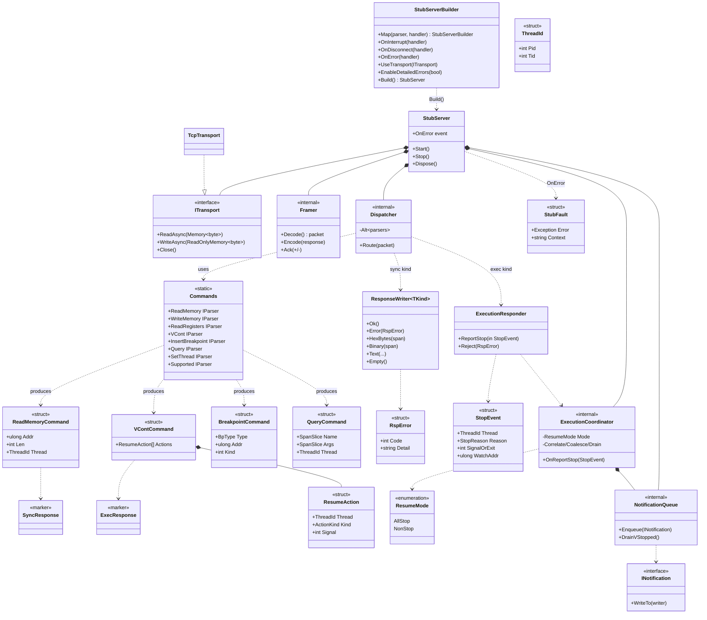

# GdbStubDotnet 技術仕様書

**実装着手可能な詳細技術仕様**
バージョン: 0.1（設計確定版）／対象 TFM: `net10.0`

---

## 0. 概要・位置づけ

`GdbStubDotnet` は、**GDB Remote Serial Protocol (RSP) のスタブ側**を .NET 上に構築するための、**ターゲット非依存の汎用フレームワーク**である。GDB（クライアント）が `target remote` で接続してくる相手＝「スタブ」を、本ライブラリ上にコマンドハンドラを登録する形で組み立てる。

- **役割**: ホスト側 RSP サーバ。フレーミング・解析・ディスパッチ・応答整形・実行/通知の協調を担い、**実際のメモリ/レジスタ/実行はライブラリ利用者が自分のターゲット実装で供給**する。
- **初の検証シナリオ**: C# ホスト型エミュレータ（プロセス内のエミュレータを GDB からデバッグ）。
- **アーキテクチャ方針**: コア**アーキテクチャ非依存**。（ライブラリ本体はアーキを内包しない）。
- **トランスポート**: 抽象化された全二重 async バイト I/F。同梱・検証済みトランスポートは **TCP 単一クライアント**（同時 1 接続、切断後の再 listen による再接続可、多重接続なし）。

本仕様書は本ライブラリ**固有**の設計・契約・根拠を定義する。RSP のワイヤ形式、Nibblr の内部、.NET BCL の仕様は**再掲しない**（§1.4 参照誘導）。

---

## 1. スコープ・前提

### 1.1 対象読者

| 区分 | 読者 | 用途 |
|---|---|---|
| 主 | 本ライブラリを**実装する開発チーム** | 設計・公開契約・根拠の権威 |
| 副 | **保守/レビュー担当** | 更新時の判断（記載基準＋決定ログ） |

**範囲外**: ライブラリ利用者向けの使い方ガイド／API リファレンス／チュートリアルは**別成果物**。本仕様は公開 API の*契約*を定義するが、使い方解説は含めない。

### 1.2 使用場面

- 実装着手・実装中の権威（何を作るかの基準）。
- 設計レビュー。
- 更新時の判断基準（§1.3 の記載/非記載基準＋付録 A 決定ログ）。

### 1.3 記載する／しない（更新判断の基準）

| | 内容 |
|---|---|
| **記載する** | 本ライブラリ固有の: アーキテクチャと層責務／公開 API 契約／拡張機構／コア・拡張コマンド境界／エラーモデル／非同期・割込・スレッドモデル／性能制約／テスト戦略／決定ログ／クラス図／命名規則・library 語一覧 |
| **記載しない（参照へ誘導）** | RSP ワイヤ形式（パケット構文・各コマンドのバイト配置・チェックサム算法）／Nibblr 内部（コンビネータ意味論・nom 由来仕様）／.NET BCL API ／参照から自明に導けるもの全般 |

> **基準の一文**: 「GDB RSP 参照 or Nibblr 仕様に書いてあることは再掲しない（参照する）。本仕様はこのライブラリ固有の決定・契約・根拠だけを記録する。」

### 1.4 参照ドキュメント

| 略称 | 文書 | 参照する内容 |
|---|---|---|
| GDB-RP | GDB *Remote Protocol*（`sourceware.org/gdb/current/onlinedocs/gdb.html/Remote-Protocol.html`） | パケット構文・各コマンドの意味・stop reply・通知・`qSupported` 機能名 |
| Nibblr | Nibblr 仕様書（同梱） | パーサコンビネータの意味論・`IParser`・`SpanSlice`・エラーモデル |
| MS-Docs | Microsoft .NET ドキュメント | `ArrayBufferWriter<byte>`・`IBufferWriter<byte>`・`System.Threading.Channels`・`IUtf8SpanParsable`・`Utf8.TryWrite` 等 |

---

## 2. 用語・命名規則

### 2.1 命名方針

- **公式名を尊重する**: 既に GDB/RSP に公式名がある概念には、勝手な別名を付けない（例: `vCont`, `qSupported`, `stop reply`, `non-stop`）。
- **造語は新機構のみ**: 本ライブラリ固有の新しい機構にだけ命名し、その名は**記述的**にする（例: `ExecutionResponder`, `ResponseWriter`）。
- **フィールドに先頭アンダースコアを付けない**。
- ルート namespace `GdbStubDotnet` がブランドを担うため、型名から `Rsp`/`Gdb` 接頭辞は原則落とす。RSP/プロトコル語を型名に残すのは衝突回避が要る箇所のみ（例: `RspError`）。

### 2.2 library 語一覧（本ライブラリ固有の造語）

| 語 | 意味 |
|---|---|
| `StubServer` | RSP サーバ本体。接続ごとに I/O ループを所有する。 |
| `StubServerBuilder` | 登録・構成を受け、検証して `StubServer` を生成する。 |
| `ResponseWriter<TKind>` | 同期コマンドの終端応答ライタ（プール・呼出中のみ有効）。 |
| `ExecutionResponder` | 実行コマンドの長命・スレッドセーフな応答器。停止を `ReportStop` で報告する。 |
| `SyncResponse` / `ExecResponse` | 応答種マーカ型。コマンド DTO に付与され、`Map` が responder 型を選ぶ。 |
| `StopEvent` | 停止の理由・対象スレッドを表す DTO（利用者が埋める）。 |
| `ResumeAction` | `vCont` から解析された 1 アクション（継続/ステップ/停止/シグナル）。 |
| `StubFault` | ホスト側へ通知する診断情報（ハンドラ例外等）。 |
| `RspError` | GDB へ返す `E NN` エラーを表す値。 |

> RSP/GDB 由来語（`vCont`, `qSupported`, `pPID.TID`, `%Stop`, `vStopped`, stop reply 等）の意味は GDB-RP を参照。

---

## 3. アーキテクチャ

### 3.1 層構成と責務

```
        ┌──────────────────────────────────────────────┐
  Host →│ StubServerBuilder → StubServer (I/Oループ所有)  │
        └──────────────────────────────────────────────┘
                         │
   ┌─────────────┬───────┴────────┬──────────────┬──────────────┐
   ▼             ▼                ▼              ▼              ▼
[Transport]  [Framer]       [Dispatcher]   [Execution/    [Diagnostics]
 ITransport   (固定)         Alt(parsers)    Notification    StubFault
 TcpTransport  $..#cs/RLE     +Map登録        Coordinator    →OnError
              /}esc/cksum                    +Queue(%/vStopped)
                                │
                         ┌──────┴───────┐
                         ▼              ▼
                   [Parsing(Nibblr)] [Response]
                    Commands.*        ResponseWriter<TKind>
                    + Command DTOs    ExecutionResponder
```

| 層 | 責務 | 拡張性 |
|---|---|---|
| トランスポート | バイトの全二重搬送 | `ITransport` で差替可。同梱 `TcpTransport`。 |
| フレーミング | `$payload#cs`・`+/-` ack・RLE・`}` エスケープ・チェックサム | **固定インフラ（単一内部シーム）。コマンド単位の拡張対象外**。 |
| ディスパッチ/登録 | 登録パーサ群の `Alt` でルーティング、種に応じた responder を渡してハンドラ呼出 | `Map`/`OnInterrupt`/`OnDisconnect` で拡張。 |
| 解析（Nibblr） | パケット payload → 型付きコマンド DTO | `Commands.*` を利用、独自コマンドはパーサを追加。 |
| 応答 | 終端応答（同期）／停止報告（実行）の整形 | `ResponseWriter<TKind>` の制約付き拡張で型安全。 |
| 実行・通知 FW | resume の遅延応答・モード変換・相関・合流・`%Stop`/`vStopped` ドレイン・interrupt 経路 | 内部機構。利用者は `StopEvent` を渡すのみ。 |
| 診断 | ハンドラ例外等を `StubFault` として `OnError` へ | イベント購読のみ。 |

### 3.2 データフロー（受信→応答）

1. `ITransport` がバイトを受信。
2. `Framer` が `$..#cs` を検証し、`-`/`+` を自動 ack、RLE/`}` を復号して **payload span** を得る。
3. `Dispatcher` が登録パーサ群の `Alt` で payload を照合し、最初に成功したパーサの **コマンド DTO** を得る。一致なしなら**空パケット `$#00`**。
4. DTO の応答種（`SyncResponse`/`ExecResponse`）に応じて responder を生成し、登録ハンドラを呼ぶ。
5. ハンドラ（利用者）は自分のターゲットを叩き、`ResponseWriter` に終端を書く／`ExecutionResponder` に停止を報告する。
6. `Framer` が応答を `$..#cs` で包んで `ITransport` へ送出。

### 3.3 統一ハンドラモデル

- **コアコマンドも拡張コマンドも、同一の公開機構（`Map`）で登録された既定ハンドラに過ぎない**。特権パスは持たない。
- 唯一の例外は**フレーミング層**（固定インフラ）と、後述の**現在スレッド状態（`H`）**の FW 追跡。
- 利用者は既定登録を**上書き・追加・不採用**にできる。

---

## 4. 実行・並行モデル

### 4.1 サポート範囲

- **all-stop ＋ non-stop の両方**を実装。
- **マルチスレッド・マルチプロセス**を完全サポート。スレッド/プロセス ID は `pPID.TID` 表記。
- 機能交渉は **`qSupported`**（対応機能名は GDB-RP 参照）。non-stop は完全実装。

### 4.2 スレッドモデル

- **接続ごとに単一の I/O ループ（1 スレッド）**。フレーミング・ディスパッチ・同期応答はすべてこの I/O スレッド上で実行。
- **ターゲットの実行は、ターゲット自身のスレッド**で進む（ライブラリは関与しない）。
- ターゲットスレッドからの停止報告（`ExecutionResponder.ReportStop`）は、**`System.Threading.Channels` 経由で I/O ループへ橋渡し**される。stop reply / `%Stop` の送出は I/O スレッドが行う。
- **`CancellationToken` は API のどこにも用いない**（§8 と整合）。

### 4.3 実行制御の協調（resume の処理段）

`vCont`/`c`/`s` 等の実行コマンドは、同期 1 応答では表現できない以下の段を要する。これらは **FW が所有**する:

1. アクション解析（`vCont` → `ResumeAction[]`）— *パーサ*。
2. resume 開始（即時 return）— *利用者がターゲットで駆動*。
3. 応答の遅延 — *FW*。
4. `StopEvent` の相関 — *FW*。
5. モード変換 — *FW*:
   - **all-stop**: 他スレッドを停止させ、**単一の stop reply** を返す。
   - **non-stop**: **即時 `OK`**、その後スレッド毎に `%Stop` → `vStopped` ドレイン。
6. interrupt 経路（`0x03`/`vCtrlC` → ターゲット停止要求）— *FW が経路、停止要求自体は利用者ハンドラ*。
7. 多スレッド停止の合流・フィルタ — *FW*。

### 4.4 停止報告の規律（reporter のスコープ）

- **「停止したら無条件に報告」は誤り**。`ReportStop` を受ける reporter は**1 回の resume にスコープ**される。
- FW がゲートする: all-stop は**単発**、non-stop は**複数発**、resume 外の停止は**無視**。
- `s`（ステップ）は「1 命令後に停止する継続」として扱い、停止時に `StopEvent`（理由 = SIGTRAP 相当）→ `T05` を生成する。

### 4.5 通知（`%` パケット）と二段 ack

- non-stop の非同期事象（スレッド停止、スレッド/プロセス生成・終了、ライブラリロード）に `%` 通知を用いる。
- **二段 ack**:
  1. フレーミング ack（`+`/`-`）。
  2. 内容 ack（`%Stop` → `vStopped` … → `OK` のドレイン）。
- 通知抽象は `INotification`。`%Stop` 整形・`vStopped` ドレイン・内容 ack は `NotificationQueue`（内部）が担う。

### 4.6 割込・切断・終了

| 事象 | 入口 | 応答 |
|---|---|---|
| 生 `0x03`（非パケット） | `OnInterrupt(handler)` | 直接応答なし。実行中 `ExecutionResponder` が結果の stop reply（SIGINT）を出す。 |
| `vCtrlC`（パケット） | 内部で interrupt 経路へ集約 | 同上。 |
| `vCont`/`c`/`s`/`D`(detach)/その他パケット | 通常の `Map` | 各ハンドラ。 |
| TCP 切断 | `OnDisconnect(handler)` | 応答なし。後始末。`D`(detach) とは別。 |
| 終了 | ホストが `StubServer.Stop()`/`Dispose()` | コールバックなし。 |

---

## 5. コマンド体系・コア/拡張境界

### 5.1 境界

| 区分 | 内容 | 提供形態 |
|---|---|---|
| **コア（組込み既定）** | フレーミング層（固定）＋ **T0/T1 コマンド集合**（基本的なメモリ/レジスタ/実行/ブレーク/クエリ） | `Map` による既定登録ハンドラ（上書き可） |
| **拡張（T2）** | `qRcmd`・`qXfer`・`vFile`・トレースポイント・リバース実行 等 | 利用者が `Map` で追加。サンプル拡張＝`qRcmd`（monitor） |
| **未対応** | 上記いずれにも一致しないパケット | **空パケット `$#00`** を自動返却 |

> T0/T1/T2 はコマンド集合の段階を指す内部呼称。各コマンドのワイヤ仕様は GDB-RP 参照。

### 5.2 終端応答の分類（同期コマンド）

すべての**終端**応答は次の 3 つのいずれかに正規化される:

| 種別 | ワイヤ | `ResponseWriter` メソッド |
|---|---|---|
| エラー | `E NN`（または `E.<text>`） | `Error(RspError)` |
| 成功 | `OK` または値（hex/binary/text） | `Ok()` / `HexBytes()` / `Binary()` / `Text()` |
| 未対応 | `$#00`（空） | `Empty()`（FW 既定でも自動） |

**終端でない出力**（`ResponseWriter` では扱わない）:

- `O`（コンソール出力）
- `%Stop`（非同期通知）
- `F`（File-I/O）

これらは**別シンク**で扱う（実行/通知 FW・File-I/O シンク）。エラーは全コマンド共通（コマンド毎に入れ子化しない）、未対応は FW 既定。

---

## 6. 公開 API 契約

### 6.1 設計原則（重要）

- **強制 behavioral interface を持たない**。`IRspMemoryAccess` のような「ターゲットに実装を強いる I/F」は**設けない**。理由: 利用者がコマンドを自由に拡張・差替できなくなるため。
- **全コマンドを `Map` に一本化**。ハンドラは**自分のターゲットをクロージャで捕捉**する。
- 利用者が触れる「契約」は**すべて DATA（DTO）**: コマンド構造体・`ResumeAction`・`StopEvent`・`ThreadId`。
- 唯一残す infra 抽象は `ITransport`（バイト搬送のみ。コマンド/ターゲット抽象ではない）。

### 6.2 登録 API

```csharp
public sealed class StubServerBuilder
{
    // 同期/実行を問わず登録は Map 一本。responder 型はコマンドの Kind で決まる。
    StubServerBuilder Map<TCmd>(IParser<byte, TCmd, …> parser, HandlerOf<TCmd> handler);

    StubServerBuilder OnInterrupt(Action handler);      // 生 0x03 / vCtrlC
    StubServerBuilder OnDisconnect(Action handler);     // TCP 切断
    StubServerBuilder OnError(Action<StubFault> handler);

    StubServerBuilder UseTransport(ITransport transport);
    StubServerBuilder EnableDetailedErrors(bool on = true);
    // 他オプション: non-stop 有効化, RLE 既定 等

    StubServer Build();   // 構成・登録エラーはここで throw（fail-fast）
}
```

- ルーティングは登録パーサ群の **`Alt`**（v1）。将来は先頭バイト `Dispatch` による分岐を検討（v1 ではしない）。
- ハンドラの第 2 引数（responder）の型は、`TCmd` が持つ応答種マーカ（`SyncResponse`/`ExecResponse`）で決まる:
  - `SyncResponse` → `ResponseWriter<…>`
  - `ExecResponse` → `ExecutionResponder`
- ハンドラの**戻り値は `void`**。完了は responder への書込/報告で示す。

### 6.3 解析（Nibblr 連携）

- 標準 RSP コマンドの Nibblr パーサを `GdbStubDotnet.Commands` が提供する。利用者は wire 解析を書かない。
- 各パーサは **型付きコマンド DTO**（値型）を出力する。可変長/バイナリ payload は **`SpanSlice.Of(packet)`**（Nibblr のゼロコピー出力）で参照する。
- ルーティングは登録パーサの `Alt`。初回実行時にコンビネータと `Map` のデリゲートを構築・キャッシュ（**初回のみ割当**）、以降ゼロアロケ。**リフレクション不使用**（§8）。

提供パーサ（抜粋）:

| パーサ | コマンド | DTO（抜粋フィールド） | 応答種 |
|---|---|---|---|
| `Commands.ReadMemory` | `m` | `Addr:ulong, Len:int, Thread:ThreadId` | Sync |
| `Commands.WriteMemory` | `M` | `Addr, Data:SpanSlice, Thread` | Sync |
| `Commands.WriteMemoryBinary` | `X` | `Addr, Data:SpanSlice, Thread` | Sync |
| `Commands.ReadRegisters` | `g` | `Thread` | Sync |
| `Commands.WriteRegisters` | `G` | `Data:SpanSlice, Thread` | Sync |
| `Commands.ReadRegister` | `p` | `Number:int, Thread` | Sync |
| `Commands.WriteRegister` | `P` | `Number, Data:SpanSlice, Thread` | Sync |
| `Commands.InsertBreakpoint` | `Z` | `Type:BpType, Addr, Kind:int` | Sync |
| `Commands.RemoveBreakpoint` | `z` | `Type, Addr, Kind` | Sync |
| `Commands.SetThread` | `H` | `Op:char, Thread` | Sync（§6.6） |
| `Commands.CurrentThread` | `qC` | — | Sync |
| `Commands.ThreadInfo` | `qfThreadInfo`/`qsThreadInfo` | — | Sync |
| `Commands.Supported` | `qSupported` | `Features:SpanSlice` | Sync |
| `Commands.Query` | `qXXX`（汎用） | `Name:SpanSlice, Args:SpanSlice` | Sync |
| `Commands.Continue` | `c` | `Addr?:ulong` | Exec |
| `Commands.Step` | `s` | `Addr?:ulong` | Exec |
| `Commands.VCont` | `vCont` | `Actions:ResumeAction[]` | Exec |
| `Commands.VContQuery` | `vCont?` | — | Sync |

> DTO フィールドの正確なワイヤ対応は GDB-RP 参照。

### 6.4 同期コマンドのハンドラ

```csharp
stub.Map(Commands.ReadMemory, (cmd, res) =>      // res: ResponseWriter<SyncResponse>
{
    Span<byte> buf = …;                          // pooled（§8）
    int n = myEmu.ReadMem(cmd.Addr, buf[..cmd.Len]);  // ★利用者の任意メソッド
    if (n == 0) res.Error(RspError.Fault);
    else        res.HexBytes(buf[..n]);          // 制約付き拡張＝正しい RSP のみ書ける
});
```

- ライブラリ提供＝パーサ（`Commands.ReadMemory`）＋ライタ（`res.HexBytes`/`res.Error`）。
- `myEmu.ReadMem` は**利用者のもの**。`IRspMemoryAccess` は存在しない。
- `ResponseWriter` は**プール・呼出中のみ有効・終端 1 書込で完了**。

`ResponseWriter<TKind>` 制約付き拡張（抜粋）:

| メソッド | 出力 |
|---|---|
| `Ok()` | `OK` |
| `Error(RspError)` | `E NN` / `E.<text>` |
| `HexBytes(ReadOnlySpan<byte>)` | hex エンコード値 |
| `Binary(ReadOnlySpan<byte>)` | binary 値（`}` エスケープは書込時に適用） |
| `Text(...)` | テキスト応答（用途別） |
| `Empty()` | `$#00`（未対応） |

### 6.5 実行コマンドのハンドラ

```csharp
stub.Map(Commands.VCont, (cmd, exec) =>          // exec: ExecutionResponder（長命・スレッドセーフ）
{
    myEmu.Resume(cmd.Actions, in stop =>         // ★利用者の resume。停止時コールバック
        exec.ReportStop(in stop));               // stop: 利用者が埋める StopEvent
    // 同期終端は書かない。FW がモード変換（§4.3 §4.4）。
});
```

```csharp
public sealed class ExecutionResponder
{
    void ReportStop(in StopEvent stop);   // 後刻・別スレッドから呼ばれてよい（Channel 橋渡し）
    void Reject(RspError error);          // resume 要求が不正なとき（同期的に）
}
```

責務境界:

| 主体 | 責務 |
|---|---|
| 利用者 | resume 開始（即 return）／停止検知時に `ReportStop(StopEvent)`／不正要求は `Reject` |
| FW | モード変換・相関・合流・`vStopped` ドレイン・stop reply 整形・interrupt 経路・OK/遅延の判断（モードから自動） |

### 6.6 現在スレッド（`H`）の扱い

- メモリ/レジスタ等はスレッド/プロセス文脈に依存する。**FW が `H` 選択状態を追跡**し、後続コマンド DTO の `Thread` フィールドに**充填**する。
- 既定 `H` ハンドラがこの状態を更新する（**上書き可**）。これにより、メモリ/レジスタのハンドラは I/F 無しに対象スレッドを知れる。
- `ThreadId` は `pPID.TID`（`Pid:int, Tid:int` の readonly struct）。

### 6.7 公開 DTO

```csharp
public readonly struct ThreadId      { int Pid; int Tid; }
public readonly struct ResumeAction  { ThreadId Thread; ActionKind Kind; int Signal; }
public enum ResumeMode { AllStop, NonStop }
public enum ActionKind { Continue, Step, Stop, Signal }
public enum StopReason { SwBreak, HwBreak, Watch, Signal, Exited, Terminated }
public enum BpType     { Soft, Hard, Write, Read, Access }

public readonly struct StopEvent
{
    ThreadId Thread;
    StopReason Reason;
    int SignalOrExit;     // signal 番号 または exit コード
    ulong WatchAddr;      // watch 系のみ
}

public readonly struct RspError  { int Code; string? Detail; }   // E NN / E.<text>
public readonly struct StubFault { Exception Error; string Context; }
```

### 6.8 トランスポート

```csharp
public interface ITransport
{
    ValueTask<int> ReadAsync(Memory<byte> buffer);
    ValueTask WriteAsync(ReadOnlyMemory<byte> buffer);
    void Close();
}
```

- 同梱 `TcpTransport`（TCP 単一クライアント、切断後の再 listen 可）。利用者は独自実装を `UseTransport` で差替可能。

---

## 7. エラーモデル

エラーは**2 系統**に分離する。

### 7.1 GDB へ向けた系統（P 系）= RSP ネイティブ・自動

| 事象 | 自動応答 |
|---|---|
| チェックサム/フレーミング不整合 | `-`（nak）→ 再送 |
| コマンド処理エラー（予期内） | `E NN`（`EnableDetailedErrors` 時 `E.<text>`） |
| 未対応コマンド | `$#00`（空） |

- 予期内のハンドラエラーは `res.Error(code)`。
- これらは FW が自動で整形・送出する。

### 7.2 ホストへ向けた系統（H 系）= 診断

- ハンドラ例外は**境界で catch**し（I/O ループを殺さない）、**`OnError(StubFault)` イベントにのみ**送る。
- **`ILogger` 依存を持たない**（ロギング連携は別パッケージ。利用者が `OnError` を自分のロガーへ転送する）。`EventSource` は採用しない。
- `OnError` 未購読時の欠落は**許容**（フォールバックなし）。
- 予期しないハンドラ例外 → catch → `OnError` → GDB へは安全な応答（`E NN`）。
- 構成・登録エラーは `Build()`/`Start()` で **throw（fail-fast）**。

### 7.3 `EnableDetailedErrors`

- 開発時トグル。ON で `E.<text>`（人間可読）、OFF で汎用 `E NN`。

---

## 8. 性能制約

| 項目 | 規約 |
|---|---|
| TFM | **`net10.0`**（単一ターゲット） |
| AOT | **NativeAOT** を目標。**カスタム source generator は用いない**。 |
| リフレクション | **不使用**。パーサ解決は `typeof` キーの辞書＋`IUtf8SpanParsable` による（リフレクションでタプルを自動導出する方式は**棄却**＝ボクシング・AOT 非親和）。 |
| スレッド | 接続あたり**シングルスレッド**の I/O ループ。 |
| ゼロアロケ | **プール/再利用**（一度確保して使い回す）。`stackalloc` には依存しない方針（小固定長を除く）。 |
| 応答バッファ | 標準 **`ArrayBufferWriter<byte>`**（`IBufferWriter<byte>`）。`Clear()` で再利用、独自 owner は作らない。 |
| エスケープ | **書込時**に適用（`Binary` がバイナリ領域のみエスケープ）。フレーミングは `$..#cs` 付与のみ。 |
| RLE | **既定オフ**（v1）。 |

### 8.1 net10 が解く制約

`net10.0` は次を提供し、出力側の旧制約（netstandard2.1 時代の手動整形）を解除する:

- `allows ref struct`（C# 14）→ `ReadOnlySpan<byte>` をジェネリック型引数に使える。
- `IUtf8SpanFormattable` / `Utf8.TryWrite` / `CompositeFormat`。

ただし **ref struct は `await` を跨げない**（これは net10 でも不変）。よって遅延応答に関わる `ExecutionResponder` は**プールされた参照型**であり、ref struct ではない。

### 8.2 範囲外

- **IL2CPP/Unity はスタブ本体の対象外**（`net10.0` は IL2CPP 非対応）。Nibblr は net10 上で消費し、その `#if NET10_0_OR_GREATER` 拡張層も利用可能だが、Nibblr 自体の IL2CPP 可搬性をスタブが必要とするわけではない。

---

## 9. テスト戦略

3 層構成。L1+L2 をライブラリ単独・決定的に回し（主戦場）、L3 を実 GDB 受入として絞って回す。

| 層 | 名称 | 内容 | 決定性 |
|---|---|---|---|
| L1 | 単体 | フレーミング/解析/応答/ディスパッチ/ゼロアロケ/エラーの各単位 | 完全決定的 |
| L2 | コンポーネント | **スクリプト化 RSP クライアント＋モックターゲット**で全プロトコル交換を検証 | 完全決定的（主戦場） |
| L3 | 結合 | **実 `gdb` プロセス**（`target remote :port`）をサンプルエミュレータに対して実行 | 実 GDB 受入・互換、限定的 |

### 9.1 golden transcript

- 実 GDB を `set debug remote 1` / `set remotelogfile` で捕捉し、L2 で**決定的に再生**する。

### 9.2 ゼロアロケ検証

- `GC.GetAllocatedBytesForCurrentThread()` の差分で確認し、**CI ゲート**にする（初回構築割当を除いた定常区間で 0）。

### 9.3 CI マトリクス

| ジョブ | 範囲 | OS |
|---|---|---|
| 常時（各コミット） | L1+L2 | 全 OS |
| 固定 gdb ジョブ | L3（`gdb -batch` / MI） | ピン留め gdb |

### 9.4 実ハードウェアの位置づけ

- ライブラリ正当性の検証に**実 RX マイコンは不要**（GDB 公式スタブ診断 `set debug remote` で足りる）。
- 実 RX を用いた検証は**CI 外のオプション受入テスト**（利用者の RX ターゲット実装＋シリコン＋実 GDB の検証）。本ライブラリはホスト側 RSP サーバであり、RX へは利用者のターゲットがプローブ経由で橋渡しする。

---

## 10. クラス図



---

## 付録 A. 決定ログ

更新時の前提が辿れるよう、設計判断と根拠を記録する。

| # | 決定 | 根拠 |
|---|---|---|
| A-1 | ターゲット非依存の汎用フレームワーク。コアはアーキ非依存。 | 用途を「C# エミュレータ」に限定せず再利用可能にする。 |
| A-2 | トランスポートを `ITransport` で抽象化、同梱は TCP 単一クライアント。同時 1 接続・再接続可・多重なし。 | 検証範囲を絞りつつ差替を許す。 |
| A-3 | all-stop ＋ non-stop、マルチスレッド/プロセス完全対応。ID は `pPID.TID`、`qSupported` 交渉。 | GDB の標準的デバッグ体験を満たす。 |
| A-4 | フレーミング層は固定インフラ（単一内部シーム）。コマンド単位では拡張しない。 | プロトコル外殻は不変、拡張は意味層に限定。 |
| A-5 | **強制 behavioral interface を廃止**し、全コマンドを `Map`＋クロージャに一本化。 | I/F 強制は利用者のコマンド拡張・差替を妨げる。 |
| A-6 | ライブラリは標準 RSP の Nibblr パーサ群（`Commands.*`）・応答ライタ・実行/通知 FW を提供。利用者はハンドラのみ。 | wire 解析と協調機構の再実装を不要にする。 |
| A-7 | 解析は Nibblr コンビネータ。各コマンド＝型付き値出力、ルーティングは `Alt`（v1）。可変長は `SpanSlice`。 | 正規表現では payload 抽出と型付けが両立しない問題を解消。リフレクション無しで AOT 安全。 |
| A-8 | ハンドラ戻り値は `void`。完了は responder への書込/報告で示す。 | 同期/非同期を同一登録形に収める。 |
| A-9 | 同期コマンドは `ResponseWriter<TKind>`（プール・呼出中のみ）。終端は {`E`/成功/`$#00`} の 3 種に正規化。`O`/`%Stop`/`F` は別シンク。 | 応答経路を型安全かつ単純化。 |
| A-10 | 実行コマンドは `ExecutionResponder`（長命・スレッドセーフ）に `ReportStop(StopEvent)`。resume 駆動は利用者、遅延/モード変換/相関/合流/ドレインは FW。 | 同期 1 応答では resume の多段が表現不能なため。 |
| A-11 | **登録動詞は `Map` 一本。responder 型はコマンドの Kind（`SyncResponse`/`ExecResponse`）で変える。** | 「Map 一本」を保ちつつ、寿命/スレッド性の差をハンドラ引数型で明示し footgun を排除。 |
| A-12 | 生 `0x03` は `OnInterrupt`。`vCtrlC` も interrupt 経路へ集約。TCP 切断は `OnDisconnect`。終了は `Stop()`/`Dispose()`。`CancellationToken` 不使用。 | 非パケット割込と切断を通常経路から分離。 |
| A-13 | `H`（現在スレッド）は FW が状態追跡し、後続 DTO の `Thread` に充填。既定 `H` ハンドラは上書き可。 | I/F 無しでスレッド文脈をハンドラへ届ける。 |
| A-14 | エラーは 2 系統。対 GDB は RSP ネイティブ自動（`-`/`E NN`/`$#00`）、対ホストは `OnError(StubFault)` のみ。`ILogger`/`EventSource` 非依存。未購読欠落は許容。構成エラーは fail-fast。 | プロトコル応答と診断を分離、依存を最小化。 |
| A-15 | TFM=`net10.0` 単一。NativeAOT 目標、source generator 無し、リフレクション無し、シングルスレッド。IL2CPP/Unity は対象外。 | AOT・ゼロアロケと net10 機能（`allows ref struct` 等）の両立。 |
| A-16 | ゼロアロケ＝プール/再利用、`ArrayBufferWriter<byte>` 背面、書込時エスケープ、RLE 既定オフ。 | 定常区間 0 割当を CI で担保。 |
| A-17 | `ExecutionResponder` は ref struct ではなくプール参照型。 | ref struct は `await` を跨げない（net10 でも不変）。 |
| A-18 | テスト 3 層（L1 単体／L2 コンポーネント＝主戦場／L3 実 gdb）。golden transcript で決定的再生。ゼロアロケは `GC.GetAllocatedBytesForCurrentThread` 差分で CI ゲート。実 RX はライブラリ正当性に不要（CI 外オプション）。 | 決定性を最大化し、実 GDB 受入を絞る。 |
| A-19 | ライブラリ名＝`GdbStubDotnet`（ルート namespace 兼パッケージ）。型から `Rsp`/`Gdb` 接頭辞は原則除去。 | 名前空間がブランドを担う。 |

---

## 付録 B. 参照リンク

| 文書 | 参照箇所 |
|---|---|
| GDB-RP | パケット構文・各コマンド意味・stop reply・通知・`qSupported` 機能名。`sourceware.org/gdb/current/onlinedocs/gdb.html/Remote-Protocol.html` |
| Nibblr 仕様 | `IParser`・`ParseResult`・`SpanSlice`・コンビネータ（`Alt`/`Map`/`Tag`/`TakeWhile` 等）・エラーモデル・`#if NET10_0_OR_GREATER` 拡張層 |
| MS-Docs | `ArrayBufferWriter<byte>`・`IBufferWriter<byte>`・`System.Threading.Channels`・`IUtf8SpanParsable`・`Utf8.TryWrite`・NativeAOT |

---

*以上。本書は設計確定事項を記録する。ワイヤ仕様・Nibblr 内部・BCL の詳細は各参照に従い、本書では繰り返さない。*
