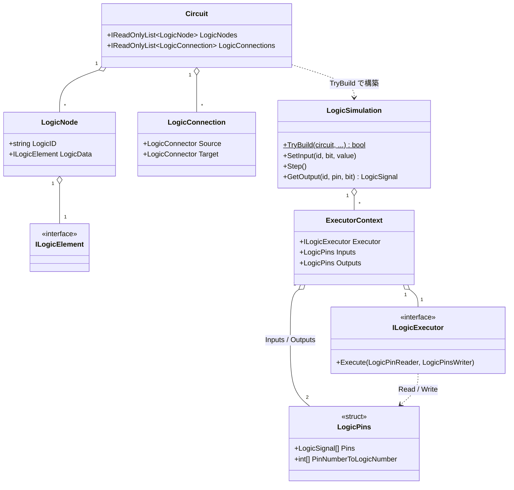

# LogicSimulator 仕様書

LogicSimulator の **設計意図とアーキテクチャ** を記述した仕様書です。

> **この仕様書の役割分担（重要）**
> - **設計意図・アーキテクチャ・「なぜそうなっているか」** → この仕様書に書く。
> - **API の詳細（メソッドのシグネチャ・引数・戻り値・エラー発生条件・各素子の真理値表）** → ソースコードの XML ドキュメントコメントに書く。仕様書からはクラス名・メソッド名で参照するに留め、**重複（二重保守）を避ける**。
>
> 例えば各エラーの発生条件は [`LogicSimulation.TryBuild`](../../../LogicSimulator/LogicSimulation.cs) の XML コメント、各ゲートの真理値表は各素子クラス（[`Gates/And.cs`](../../../LogicSimulator/Gates/And.cs) など）やテスト（[`LogicSimulatorTest/LogicGateTest.cs`](../../../LogicSimulatorTest/LogicGateTest.cs)）を参照してください。

---

## 1. このライブラリの責務とスコープ境界

新しい機能を追加するとき、**このライブラリに入れるべきか、別ライブラリ／別プロジェクトにすべきか** を判断するための基準です。

### 責務（このライブラリが担うこと）

3値論理（[`LogicSignal`](../../../LogicSimulator/LogicSignal.cs) の `X` / `Low` / `High`）による **デジタル論理回路の「定義・検証・シミュレーション実行」**。

- 組合せ回路・順序回路（フリップフロップ等）の素子の演算
- 回路の階層合成（[`CustomCircuit`](../../../LogicSimulator/CustomCircuit.cs) による部品としての再利用）
- 多ビットバス配線
- 大量素子を高速に動かすための **バッチ実行** と **ゼロアロケーション**

### スコープ境界（このライブラリが担わないこと）

- **可視化・UI・3D描画** … 回路の描画や編集 UI は別プロジェクトの責務。

LogicSimulator は **オンメモリのデータ構造と演算** に集中します。

### 追加判断基準

ある関心事を、**「入力ピン → 出力ピンの3値論理演算」として [`ILogicElement`](../../../LogicSimulator/ILogicElement.cs) ＋ [`ILogicExecutorFactory`](../../../LogicSimulator/ILogicExecutorFactory.cs) で表現できるか** を基準にします。

- 表現できる → このライブラリに素子として追加する（→ [extending.md](extending.md)）。
- 表現できない（描画・I/O など） → 別ライブラリの責務とする。

---

## 2. 用語集

| 用語 | 意味 |
|---|---|
| **LogicSignal** | 信号の3値。`X`（不定）/ `Low` / `High`。 |
| **素子（ILogicElement）** | 論理素子の**構成データ**（型＋パラメータ）。演算ロジックそのものは持たない。データと演算を分離している点に注意。 |
| **LogicNode** | `LogicID`（識別子）と素子データ（`ILogicElement`）の組。 |
| **ピン / バス** | 素子の入出力端子（[`PinDefinition`](../../../LogicSimulator/PinDefinition.cs)）。1ビットの**スカラーピン**（`IsIndexed=false`）と、多ビットの**バスピン**（`IsIndexed=true`、`in[0]` のようなインデックス記法）がある。 |
| **LogicConnection / LogicConnector** | 配線。出力ピン（Source）から入力ピン（Target）への接続。 |
| **Executor（ILogicExecutor）** | 素子の**演算ロジック**。`Execute(LogicPinReader, LogicPinsWriter)` を実装する。 |
| **ExecutorContext** | 1つの Executor と、その入出力 `LogicPins`・変化追跡情報・接続先をまとめた内部単位。 |
| **LogicPins** | 複数素子の全ピンを1本の配列に**平坦化**して保持する構造体。 |
| **logicNumber** | 1つの Executor がまとめて持つ素子のうち、何番目の素子かを表す番号。 |
| **Circuit** | 素子（`LogicNodes`）と配線（`LogicConnections`）の集合。回路の定義。 |
| **CustomCircuit** | 別の回路を名前で参照し、部品として組み込む素子。 |
| **LogicSimulation** | ビルド済みのシミュレーション本体。`TryBuild` / `SetInput` / `Step` / `GetOutput`。 |

---

## 3. 全体アーキテクチャ



ポイント: **同じ種類（同じ型）の素子は1つの Executor を共有** します。例えば回路に `AndLogic` が100個あっても Executor は1つで、`logicNumber` で各素子を区別します。この設計の狙いは [batch-execution-model.md](batch-execution-model.md) を参照してください。

---

## 4. クイックスタート（利用者向け）

NOT ゲート1つの最小回路を組み立てて動かす例です。

```csharp
using LogicSimulator;
using LogicSimulator.Gates;

// 1. 回路を定義する（素子の一覧と、配線の一覧）
var circuit = new Circuit(
    [
        new("input",  new InputConnector()),   // 外部入力コネクタ
        new("not1",   new NotLogic()),          // NOT 素子
        new("output", new OutputConnector())    // 外部出力コネクタ
    ],
    [
        new(new LogicConnector("input", "out"), new LogicConnector("not1",   "in")),
        new(new LogicConnector("not1",  "out"), new LogicConnector("output", "in")),
    ]);

// 2. ビルドする（検証に失敗すると false、errors に理由が入る）
if (!LogicSimulation.TryBuild(circuit, out var simulation, out var errors)) {
    // errors（CircuitError[]）を処理する
    return;
}

// 3. 入力を設定し、収束するまで実行し、出力を読む
simulation.SetInput("input", bitIndex: 0, LogicSignal.High);
simulation.Step();
var result = simulation.GetOutput("output", "in"); // => LogicSignal.Low
```

### ピン命名規則

| 種類 | ピン名の例 |
|---|---|
| 出力ピン（スカラー） | `out` |
| 入力ピン（スカラー） | `in` |
| バスピンの各ビット | `in[0]`, `in[1]`, … |
| CustomCircuit のピン | 参照先回路のトップレベル `InputConnector` / `OutputConnector` の `LogicID` |

### 階層回路（CustomCircuit）

`TryBuild` の `circuitLibrary` 引数に「回路名 → `Circuit`」の辞書を渡すと、回路内の `CustomCircuit` がその定義で展開されます。組み込み回路の例は [`BuiltInCircuits`](../../../LogicSimulator/BuiltInCircuits.cs)（`BuiltInCircuits.Circuits`）を参照してください。

---

## 5. ドキュメント索引

| ドキュメント | 内容 |
|---|---|
| [batch-execution-model.md](batch-execution-model.md) | **★最重要。** 複数の素子を1メソッドでまとめて演算するバッチ実行モデル。なぜバッチ処理するのか、ゼロアロケーション方針を含む。 |
| [build-pipeline.md](build-pipeline.md) | `TryBuild` の多段フェーズの順序・依存関係（なぜこの順か）。 |
| [extending.md](extending.md) | 新しい論理素子を追加する手順と、バッチ実行に則った Executor 実装の作法。 |
