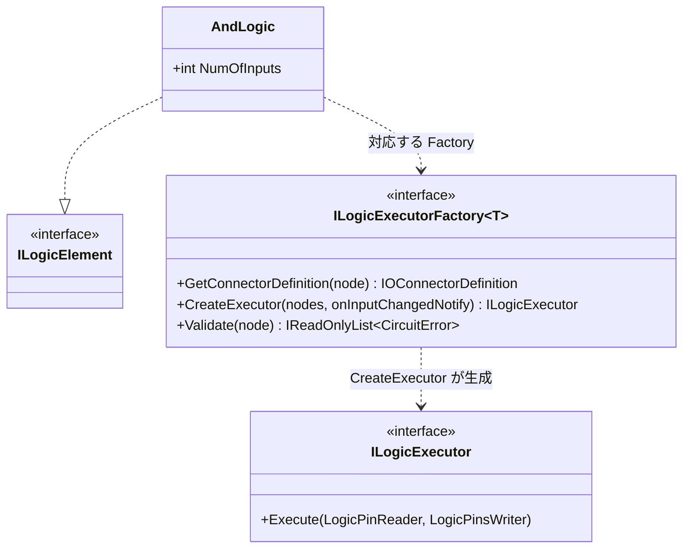

# 拡張手順 ― 新しい論理素子を追加する

新しい論理素子を追加するときの手順と、[バッチ実行モデル](batch-execution-model.md) に沿った Executor 実装の作法をまとめます。代表例として AND ゲート（[`Gates/And.cs`](../../../LogicSimulator/Gates/And.cs)）を参照します。

> 追加してよいかの判断基準（このライブラリの責務）は [README の「責務とスコープ境界」](README.md#1-このライブラリの責務とスコープ境界) を参照してください。

---

## 全体像

素子は **データ（構成）と演算（ロジック）を分離** しています。1つの素子を追加するには、次の3つを用意します。



---

## 手順 1: 素子データ（ILogicElement）を定義する

素子の**構成パラメータ**（入力数など）を持つ `record` を定義します。演算ロジックは含めません。

```csharp
public record AndLogic(int NumOfInputs) : ILogicElement;
```

---

## 手順 2: Factory（ILogicExecutorFactory&lt;T&gt;）を実装する

[`ILogicExecutorFactory<T>`](../../../LogicSimulator/ILogicExecutorFactory.cs) を実装し、次の2つ（必要なら3つ）を提供します。

### GetConnectorDefinition ― ピンを宣言する

その素子の入力ピン・出力ピンを [`PinDefinition`](../../../LogicSimulator/PinDefinition.cs) で宣言します。

```csharp
public IOConnectorDefinition GetConnectorDefinition(LogicNode<AndLogic> node) {
    return new IOConnectorDefinition(
        node.LogicID,
        [new PinDefinition("in", node.LogicData.NumOfInputs)],  // バスピン（NumOfInputs ビット）
        [new PinDefinition("out")]                              // スカラーピン（1ビット）
    );
}
```

- `new PinDefinition("out")` … 1ビットのスカラーピン。
- `new PinDefinition("in", n)` … `n` ビットのバスピン（`in[0]`…`in[n-1]`）。
- `new PinDefinition(baseName, index, bitCount)` … バス配列の各要素（`baseName[index]`）を `bitCount` ビットで宣言する形もあります。

### CreateExecutor ― Executor を生成する

**同じ種類の素子の配列** を受け取り、`ILogicExecutor` を1つ返します。1つの Executor が、その種類の全素子をまとめて演算します（[バッチ実行モデル](batch-execution-model.md) 参照）。

```csharp
public ILogicExecutor CreateExecutor(LogicNode<AndLogic>[] nodes, Action onInputChangedNotify) {
    return new AndExecutor();
}
```

- `nodes` … この型の全素子。素子ごとに状態を持つ場合は、この配列長ぶんの状態を Executor 内に確保し、`logicNumber` で添字アクセスします。
- `onInputChangedNotify` … **構築時点で出力値が確定している素子**（例: 定数を出力する `ConstValueLogic`）が、初期実行を予約するために呼びます。呼ぶと、最初の `Step()` でその Executor が一度実行されます。入力変化を待たずに出力を確定させたい素子で使います。

### Validate（任意） ― 構成を検証する

不正な構成（例: 入力数が0）を `CircuitError` として報告できます。既定では空（エラーなし）です。

---

## 手順 3: 既定ファクトリに登録する

[`LogicSimulation.CreateDefaultFactories`](../../../LogicSimulator/LogicSimulation.cs) に、素子の型と Factory の対応を登録します。

```csharp
{ typeof(AndLogic), new LogicExecutorFactory<AndLogic>(new AndLogicExecutorFactory()) },
```

`LogicExecutorFactory<T>` は、型なしの [`ILogicExecutorFactory`](../../../LogicSimulator/ILogicExecutorFactory.cs) と型付きの `ILogicExecutorFactory<T>` の橋渡し（`LogicNode` ↔ `LogicNode<T>` の変換）を担います。

> 未登録の型を回路に含めると、ビルド時に `CircuitErrorKind.UnregisteredLogicElement` で弾かれます。

---

## Executor 実装の作法

`Execute` は1ステップで何度も呼ばれるホットパスです。次の作法を守ります。

```csharp
public void Execute(LogicPinReader inputs, LogicPinsWriter outputs) {
    // (1) 変化した素子だけを while で取り出してまとめて処理する
    while (inputs.TryGetNextChangedLogicNumber(out var logicNo)) {
        int length = inputs.GetPinsLength(logicNo);
        // (2) 入力ピンを ReadBit で読む
        for (int i = 0; i < length; i++) {
            var signal = inputs.ReadBit(logicNo, i);
            // …演算…
        }
        // (3) 出力は WriteBit で書く（実際に変化したときだけ伝播される）
        outputs.WriteBit(logicNo, 0, output);
    }
}
```

1. **`while (TryGetNextChangedLogicNumber)`** で、入力が変化した素子だけをまとめて処理する。全素子を毎回計算しない。
2. **`ReadBit` / `GetPinsLength`** で入力を読む。`logicNo` がグループ内の素子番号。
3. **`WriteBit`** で出力する。値が変化したときだけ下流へ伝播されるので、変化判定を自前で書く必要はない。
4. **3値論理** を扱う。`Low` / `High` だけでなく `X`（不定）の伝播規則も実装する（各ゲートの規則は実装と [`LogicGateTest.cs`](../../../LogicSimulatorTest/LogicGateTest.cs) を参照）。
5. **ゼロアロケーション**: `Execute` 内で配列や `List` を新規確保しない。状態が必要なら `CreateExecutor` の時点で確保して使い回す。接続の確立・解除を伴う素子では、それらを構造体で表現して GC を避ける。

---

## 階層回路（CustomCircuit）として追加する選択肢

新しい振る舞いが、**既存の素子の組み合わせ** で表現できる場合は、コードで Executor を書く代わりに [`Circuit`](../../../LogicSimulator/Circuit.cs) を定義して [`CustomCircuit`](../../../LogicSimulator/CustomCircuit.cs) で部品化する方が簡単です。フリップフロップ・カウンタ・比較器・マルチプレクサなどはこの方式で構築されています（[`BuiltInCircuits`](../../../LogicSimulator/BuiltInCircuits.cs) 参照）。

- **基本素子（新しい演算そのもの）** → 手順 1〜3 で Executor を実装。
- **既存素子の組み合わせ** → `Circuit` を定義し回路ライブラリに登録して `CustomCircuit` で参照。
