# UsbIpDotnet 設計仕様書

> 純マネージド（ドライバ/ネイティブ非依存）・マルチプラットフォームな USB/IP 通信ライブラリ（C# / .NET 10）。
> client（USBホスト）と server（USBデバイス）の両ロールに対応し、ホットパスはゼロアロケーションを志向する。

## この文書について

**対象読者**: 本ライブラリ `UsbIpDotnet` の実装者（主）、将来のコントリビュータ、および仮想CPU/マイコンエミュレータへアダプタ経由で組み込む統合者。
**用途**: 実装の正典、コントリビュータのオンボーディング、統合者の配線指針。エンド利用者向けの入門は README で別途補完する。
**位置づけ**: リポジトリ内のリビング文書。見出しに章番号は付けない（章の途中追加で番号を振り直さないため）。図は Mermaid、ヘッダのバイト配置は ASCII、列挙・対応・API一覧は Markdown 表、利用例は C# コードブロックで記述する。

---

## スコープと責務

`UsbIpDotnet` は USB/IP プロトコルを TCP 等のストリーム上で送受信するためのプロトコル/セッションライブラリである。OS の USB ドライバには一切関与しない。実機デバイスをネットワークへ出すのは外部の usbip 実装（Linux カーネル等）の役割であり、本ライブラリはその対向として振る舞う。

**やること**
- USB/IP のアタッチ交渉（DEVLIST / IMPORT）と URB ストリーミング（CMD/RET_SUBMIT・CMD/RET_UNLINK）の符号化・復号・セッション管理。
- client ロール（USBホスト相当。デバイスを import して URB を投入）。
- server ロール（USBデバイス相当。デバイスを export し URB に応答）。
- 制御・バルク・割込・アイソクロナスの全転送タイプ。
- エンドポイント単位の転送 submit/complete、SETUP、STALL/NAK、完了イベント。

**やらないこと（非目標）**
- OS ドライバ/カーネルモジュールの提供や操作。
- 物理 USB ハードウェアへのアクセス。
- 特定 CPU のレジスタ再現（FIFO/PID/BRDY 等の再現は統合者のアダプタの責務。参考実装はサンプルとして別途提供しうる）。

責務境界の考え方: 本ライブラリの下限は「転送(URB)」の層である。仮想CPU側のレジスタモデル（例: Renesas RX の `CFIFO`/`PIPExCTR`/`USBREQ` 等）と URB の相互変換は、統合者が書く薄い**アダプタ**が担う。これにより RX でも xHCI でも同一のライブラリを再利用できる。

---

## 背景: USB/IP プロトコル概説

USB/IP は USB の転送（URB; USB Request Block）を TCP 上にトンネリングする。全フィールドはネットワークバイトオーダ（ビッグエンディアン）。バージョンはヘッダ上 `0x0111`（v1.1.1）。

- **server**: USB デバイスを export する側（デバイスを持つ/演じる）。`*_RET_*` で応答。
- **client**: デバイスを import する側（USBホストコントローラ相当）。`*_CMD_*` を送る。エクスポートされたデバイスのドライバは client 側で動作する。

本ライブラリのロール対応:

| 利用したいこと | 仮想CPUの役 | 本ライブラリの usbip ロール |
| --- | --- | --- |
| 実機デバイスと通信する | USBホスト | **client**（import・seqnum採番） |
| 実機にデバイスとして認識させる | USBデバイス | **server**（export・seqnum反射） |

### 通信フェーズ

DEVLIST は一回限りの短命接続、IMPORT 成功後は同一接続が URB ストリームへ遷移する。

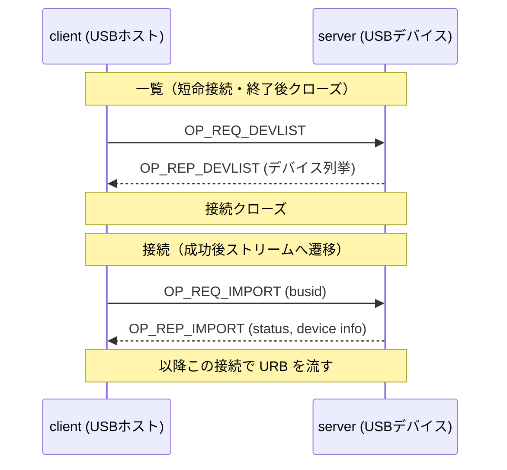

URB は多重化され、`RET_SUBMIT` は `seqnum` 順不同で返る。`UNLINK` 成功後はその URB の `RET_SUBMIT` は返らない。

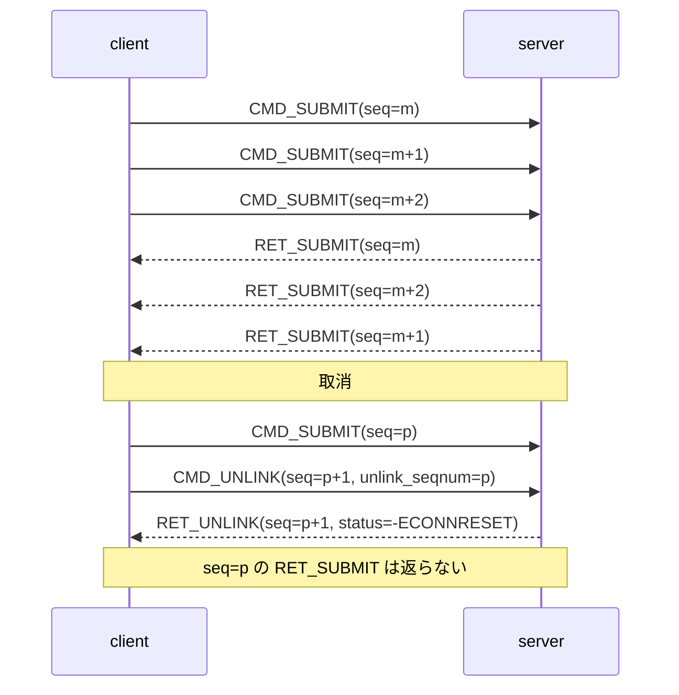

### op / コマンドコード一覧

| メッセージ | コード | 方向 | 用途 |
| --- | --- | --- | --- |
| OP_REQ_DEVLIST | `0x8005` | client→server | エクスポート一覧の要求 |
| OP_REP_DEVLIST | `0x0005` | server→client | 一覧の応答 |
| OP_REQ_IMPORT | `0x8003` | client→server | import 要求（busid 指定） |
| OP_REP_IMPORT | `0x0003` | server→client | import 応答（status 0/1） |
| USBIP_CMD_SUBMIT | `0x00000001` | client→server | URB 投入 |
| USBIP_RET_SUBMIT | `0x00000003` | server→client | URB 応答 |
| USBIP_CMD_UNLINK | `0x00000002` | client→server | URB 取消 |
| USBIP_RET_UNLINK | `0x00000004` | server→client | 取消応答 |

---

## アーキテクチャ概観

単一アセンブリ（単一 NuGet）。論理層を名前空間/フォルダで分離する。コア = L1 コーデック + L2 セッション。L3 オブジェクトモデルは任意で同梱（追加依存なし、未参照ならトリミングで除去可）。

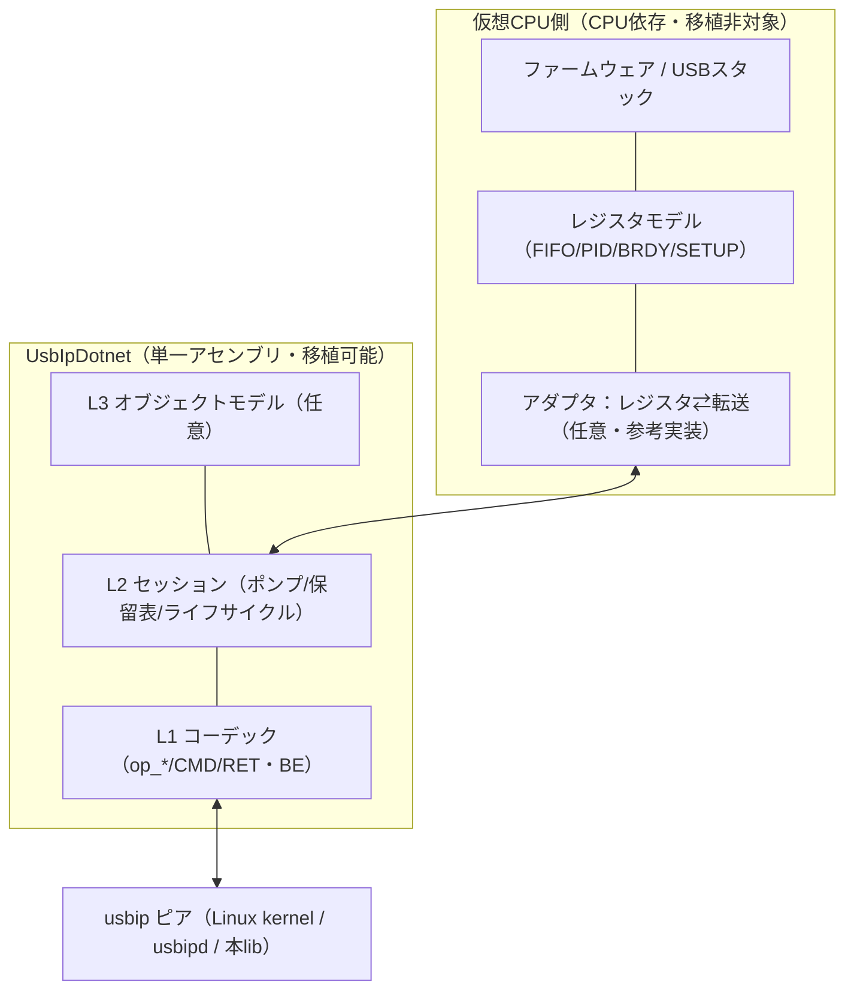

### クラス構成（継承ではなく移譲）

ロール固有型は共有の `UsbIpSessionCore`（sealed）を**保有・委譲**する。ロール固有のフレーム解釈は、コアへ注入する内部 `IUsbIpFrameHandler` を各セッションが実装する。継承は用いない。

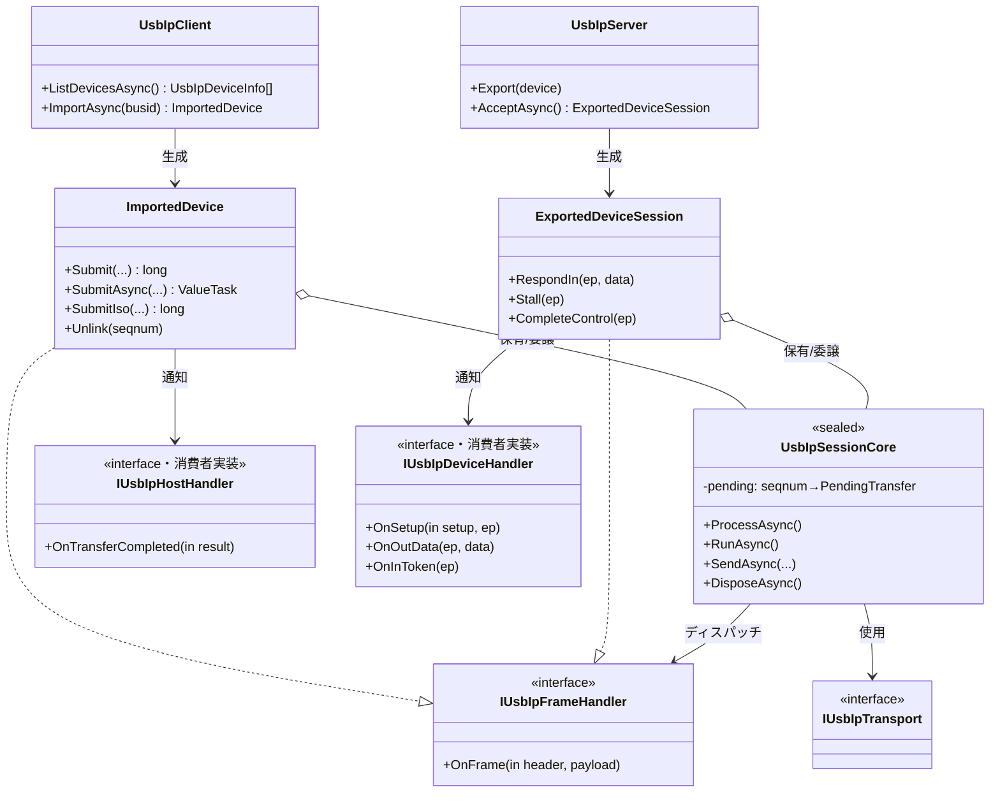

---

## トランスポート層

公開境界はトランスポート抽象 `IUsbIpTransport`。実装として TCP とインメモリ（テスト用ループバック）を同梱する。内部のホットパスは `Stream` + `ReadExactlyAsync` + `Span` 直書きで実装し、コーデックは `BinaryPrimitives` でビッグエンディアンをフィールド単位に符号化/復号する。受信ペイロードは呼び出し側所有のバッファへ**直接読み込む**（コピー1回）。`System.IO.Pipelines` や `MemoryPool` はコアでは用いない（必要なら抽象の別実装として将来追加）。

```csharp
public interface IUsbIpTransport : IAsyncDisposable
{
    // 受信: dest に「ちょうど」読み切る（内部で ReadExactlyAsync）
    ValueTask ReadExactAsync(Memory<byte> dest, CancellationToken ct = default);
    // 送信: そのまま書く（ヘッダ＋ペイロードを順に）
    ValueTask WriteAsync(ReadOnlyMemory<byte> src, CancellationToken ct = default);
}

public sealed class TcpUsbIpTransport : IUsbIpTransport { /* Socket/NetworkStream, NoDelay 推奨 */ }
public sealed class InMemoryUsbIpTransport : IUsbIpTransport { /* ループバック。手動ポンプと併用で決定論的テスト */ }
```

### TCP/ランタイム/アプリの 3 層ループ

「なぜアプリ側で受信ループが要るのか」を共有する。TCP の状態機械（ハンドシェイク・再送）はカーネル、IO 完了通知（epoll/IOCP→await再開）はランタイムが回す。**メッセージ境界を切り出す整形ループ（#3）だけが本ライブラリの責務**であり、USB/IP は多重化・サーバープッシュ型なので #3 が不可避。

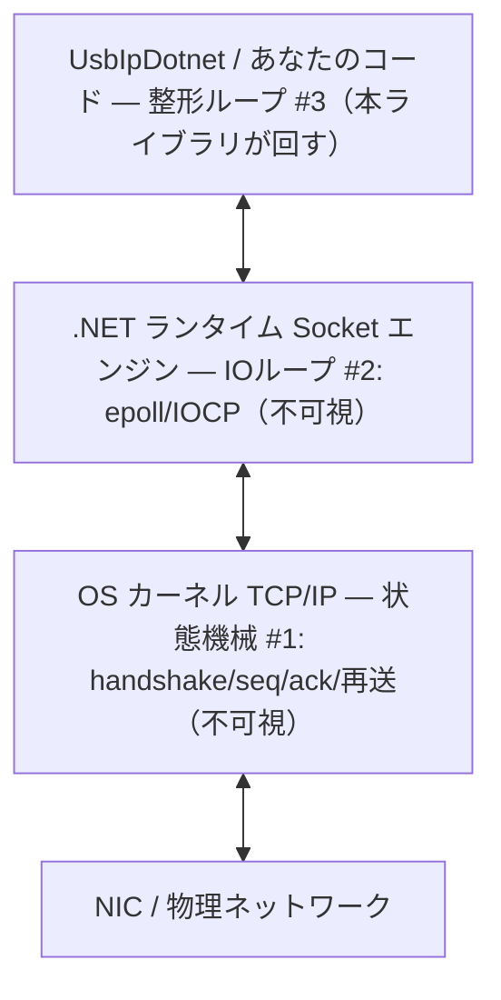

### 受信ペイロードのコピー回数（方式比較）

| 方式 | ヘッダ解析 | 大ペイロード（OUTが宛先に届くまで） |
| --- | --- | --- |
| Stream + ReadExactly（採用・直書き） | Span（コピー無） | カーネル→宛先 = **1回** |
| Pipelines（不採用・ステージング） | SequenceReader（コピー無） | カーネル→Pipe内部→宛先 = 2回 |

※中継のみ（宛先に置かない）用途では Pipelines の `ReadOnlySequence` が有利になりうるため、将来の別トランスポート実装の余地として残す。

---

## パケット / ワイヤ表現

ヘッダは readonly struct（`BinaryPrimitives` で BE 安全にフィールド単位デコード、スタック上・アロケーション無）。ペイロードは `Memory<byte>`/`ReadOnlyMemory<byte>` のビュー（外部バッファ参照・コピー無）。`MemoryMarshal` による blittable 重ね読みは BE のため用いない。

### op_common（8 バイト）

```
 offset  0       2       4               8
        +-------+-------+---------------+
        |version| code  |    status     |
        | (u16) | (u16) |    (u32)      |
        +-------+-------+---------------+
```

| フィールド | 型/サイズ | 意味 |
| --- | --- | --- |
| version | u16 BE | `0x0111`（v1.1.1） |
| code | u16 BE | op コード（DEVLIST/IMPORT） |
| status | u32 BE | 0=OK、IMPORT応答は 1=error |

### usbip_header_basic（20 バイト・SUBMIT/UNLINK 共通）

| offset | サイズ | フィールド | 意味 |
| --- | --- | --- | --- |
| 0x00 | u32 | command | 1=CMD_SUBMIT, 3=RET_SUBMIT, 2=CMD_UNLINK, 4=RET_UNLINK |
| 0x04 | u32 | seqnum | 要求と応答を対応づける連番。接続ごとに client が採番 |
| 0x08 | u32 | devid | client要求では `(busnum<<16)\|devnum`、server応答では 0 |
| 0x0C | u32 | direction | 0=OUT, 1=IN（client のみ使用、server は 0） |
| 0x10 | u32 | ep | エンドポイント番号（client のみ、UNLINK は 0） |

### USBIP_CMD_SUBMIT（48 バイトヘッダ + データ + ISO記述子）

```
 0x00            usbip_header_basic (20)            0x14
+----------------------------------------------------+
| command=1 | seqnum | devid | direction | ep        |
+----------------------------------------------------+
 0x14       0x18              0x1C        0x20        0x24      0x28        0x30
+----------+-----------------+-----------+-----------+---------+-----------+
|transfer_ |transfer_buffer_ |start_frame|number_of_ |interval | setup(8)  |
|flags(u32)|length(u32)      |(u32)      |packets    |(u32)    |           |
+----------+-----------------+-----------+-----------+---------+-----------+
 then: transfer_buffer[n]  (OUT時 n=length, IN時 n=0)  then: iso_packet_descriptor[m]
```

| フィールド | サイズ | 意味 |
| --- | --- | --- |
| transfer_flags | u32 | URB transfer_flags（URB_SHORT_NOT_OK 等） |
| transfer_buffer_length | u32 | 転送長 |
| start_frame | u32 | ISO の開始フレーム（非ISOは 0） |
| number_of_packets | u32 | ISO パケット数。**非ISOは `0xFFFFFFFF`** |
| interval | u32 | 周期（割込/ISO） |
| setup | 8B | SETUP パケット（制御転送時のみ） |

### USBIP_RET_SUBMIT（48 バイトヘッダ + データ + ISO記述子）

```
 0x00      usbip_header_basic (20)      0x14    0x18         0x1C       0x20       0x24       0x28
+----------------------------------------+------+-----------+----------+----------+----------+--------+
| command=3 | seqnum | devid | dir | ep   |status|actual_len |start_fr. |num_pkts  |error_cnt | pad(8) |
+----------------------------------------+------+-----------+----------+----------+----------+--------+
 then: transfer_buffer[n]  (IN時 n=actual_length, OUT時 n=0)  then: iso_packet_descriptor[m]
```

| フィールド | サイズ | 意味 |
| --- | --- | --- |
| status | s32 | 0=成功、負値=errno（-EPIPE 等） |
| actual_length | u32 | 実転送バイト数 |
| start_frame / number_of_packets | u32 | ISO 用 |
| error_count | u32 | ISO のエラーパケット数 |
| padding | 8B | 0 |

### USBIP_CMD_UNLINK / USBIP_RET_UNLINK（各 48 バイト）

```
 CMD_UNLINK:  header_basic(20) | unlink_seqnum(u32) | padding(24)
 RET_UNLINK:  header_basic(20) | status(s32)        | padding(24)
```

`status`: 取消成功時は `-ECONNRESET`、`RET_SUBMIT` の後に来た場合は 0。

### iso_packet_descriptor（16 バイト × number_of_packets）

```
+-----------+-----------+--------------+-----------+
| offset    | length    | actual_length| status    |
| (u32)     | (u32)     | (u32)        | (s32)     |
+-----------+-----------+--------------+-----------+
```

### usbip_usb_device（DEVLIST/IMPORT のデバイス情報）

| offset | サイズ | フィールド |
| --- | --- | --- |
| 0x000 | 256 | path（NUL終端文字列） |
| 0x100 | 32 | busid（NUL終端文字列、例 "3-2"） |
| 0x120 | u32 | busnum |
| 0x124 | u32 | devnum |
| 0x128 | u32 | speed |
| 0x12C | u16 | idVendor |
| 0x12E | u16 | idProduct |
| 0x130 | u16 | bcdDevice |
| 0x132 | 1×6 | bDeviceClass/SubClass/Protocol, bConfigurationValue, bNumConfigurations, bNumInterfaces |

DEVLIST の各デバイスにはさらに `bNumInterfaces` 個のインターフェイス記述（bInterfaceClass/SubClass/Protocol + パディング1）が続く。IMPORT 応答にはインターフェイス列は付かない。

---

## セッション / 実行モデル

### ライフサイクル

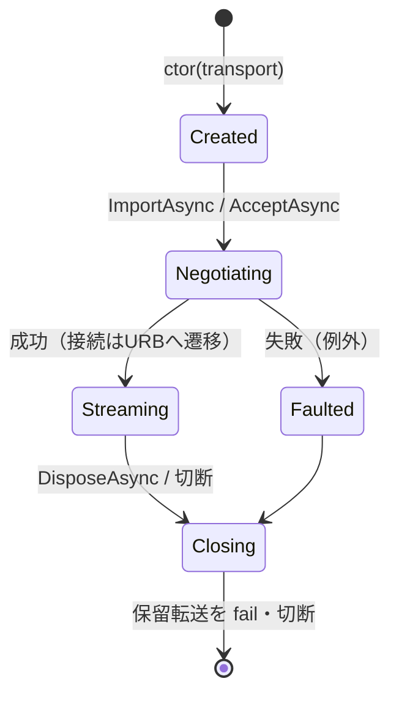

### 受信ポンプ

1 本のループがフレームを読み、解釈し、ディスパッチする。`RET_SUBMIT` の本体長は方向に依存するため、保留表（seqnum→要求）から元 CMD の方向を引いて算出する（L1 単独では決まらない＝L2 の文脈が要る）。

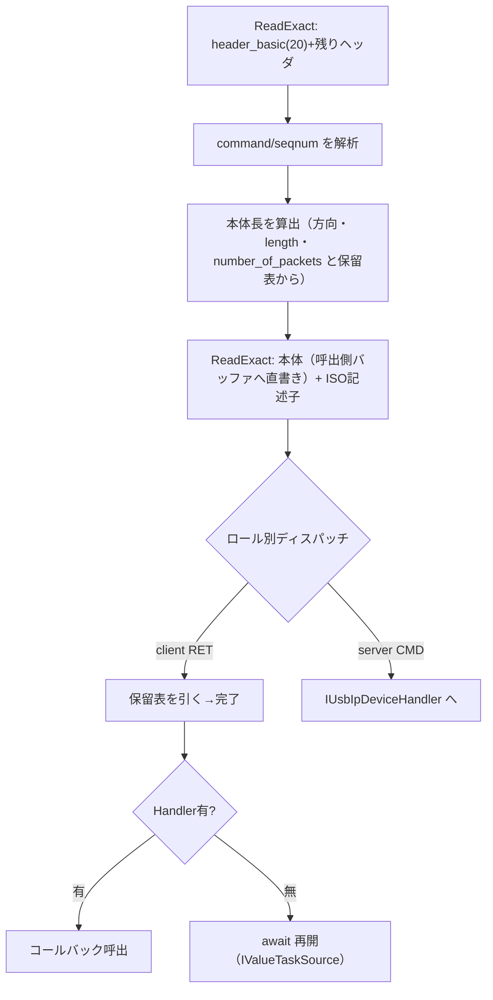

送信は単一ライタで直列化する。所有ループ（`RunAsync`）はこのポンプを背景 Task で回す薄いラッパ、手動ポンプ（`ProcessAsync`）は消費者が自スレッドで 1 単位ずつ回す。

### 並行性・スレッド安全の保証

セッションは**スレッドセーフではない。単一スレッドで駆動する**（全 API＝Submit/Unlink/Respond/Process を同一スレッドで実行、コールバックも同スレッドで直列発火）。内部ロックを持たず最速。

- 正典の使い方は**手動ポンプ**: 消費者のスレッド（エミュレータの CPU ステップスレッド等）が全てを所有し、クロススレッド問題が原理的に発生しない。
- **所有ループ**使用時に別スレッドから投入したい場合は、消費者側でループスレッドへマーシャリングする（任意で `Post(Action)` ヘルパを提供）。
- 再入規約: コールバック内からの `Submit` は可（送信キューに積むだけ）。`ProcessAsync` のネスト呼び出しは不可。

| API | スレッド安全 | 実行/発火スレッド | 再入 |
| --- | --- | --- | --- |
| Submit/SubmitAsync/Unlink/RespondIn | × | ポンプスレッドのみ | コールバック内可 |
| ProcessAsync/RunAsync | × | 単一の駆動者 | 不可（ネスト禁止） |
| コールバック（On*） | — | ポンプスレッドで直列 | Submit のみ可 |

### 背圧 / 保留表の上限

保留表は**上限つき**（設定可）。未完了が上限に達した場合:
- 同期 `Submit` は `false` を返す（=USB の NAK 相当。RX アダプタはパイプを準備未完了のままにする）。
- 非同期 `SubmitAsync` は空き（完了到着）まで await する。

送信路の TCP 背圧は非同期 write で吸収し、単一スレッドをブロックしない。

---

## ロール API

インタラクションは**コールバック interface コア + ゼロアロ async 薄ラッパ**。完了経路は保留表エントリ（`PendingTransfer`）が `IValueTaskSource<T>` を兼ね、`Handler` があればコールバック、無ければ `await` 再開、と同一台帳を共有する（`TaskCompletionSource` は使わない）。受信ペイロードは呼び出し側所有、デバイス役 OUT はヘッダ先読み→バッファ提供→本体読込の 2 段受信。

### 値型（抜粋）

```csharp
public enum UsbDir : byte { Out = 0, In = 1 }
public enum UsbIpStatus : int { Ok = 0, Stall = -32, Overflow = -75, TimedOut = -110,
                                NoDevice = -19, ShortRead = -121, Shutdown = -108, Cancelled = -104 }

public readonly struct UsbSetupPacket { public readonly byte RequestType, Request;
                                        public readonly ushort Value, Index, Length; }
public readonly struct UsbTransferResult { public readonly long Seqnum; public readonly UsbIpStatus Status;
                                           public readonly int ActualLength; }
public readonly struct UsbIsoPacketRequest { public readonly int Offset; public readonly int Length; }
public readonly struct UsbIsoPacketResult  { public readonly int ActualLength; public readonly UsbIpStatus Status; }
```

### client（USBホスト）

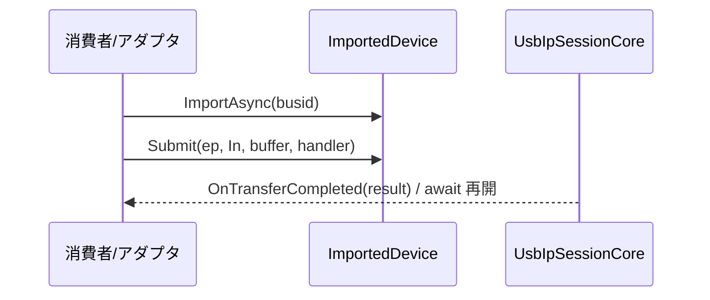

| メンバー | 署名（概略） | 説明 | 例外/結果 | ゼロアロ |
| --- | --- | --- | --- | --- |
| ListDevicesAsync | `ValueTask<IReadOnlyList<UsbIpDeviceInfo>>` | DEVLIST | UsbIpConnectionException | × (一覧は確保) |
| ImportAsync | `ValueTask<ImportedDevice>` | IMPORT | UsbIpImportException | × |
| Submit | `long Submit(byte ep, UsbDir dir, Memory<byte> buf, in UsbSetupPacket setup=default, IUsbIpHostHandler? h=null)` | 投入。満杯時は負値(=NAK) | — | ○ |
| SubmitAsync | `ValueTask<UsbTransferResult> SubmitAsync(...)` | 投入。満杯時は空き待ち | OperationCanceledException | ○（プール源） |
| SubmitIso | `long SubmitIso(byte ep, UsbDir dir, Memory<byte> buf, ReadOnlySpan<UsbIsoPacketRequest> pkts, int startFrame, int interval, IUsbIpHostHandler? h=null)` | ISO 投入 | — | ○ |
| Unlink | `void Unlink(long seqnum)` | CMD_UNLINK | — | ○ |

### server（USBデバイス）

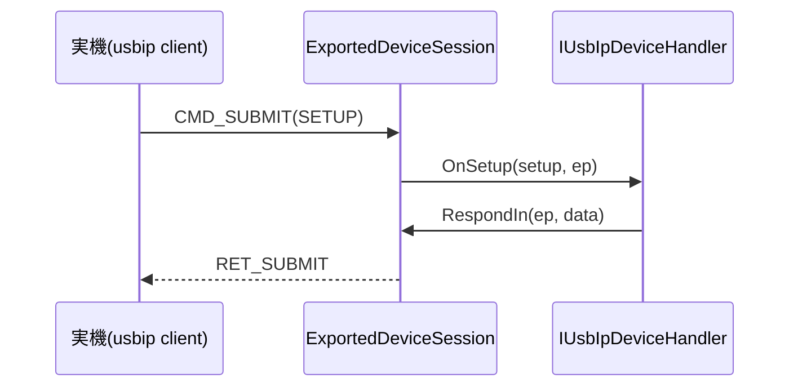

| メンバー | 署名（概略） | 説明 |
| --- | --- | --- |
| Export | `void Export(UsbIpDeviceInfo device)` | DEVLIST 応答用に広告 |
| AcceptAsync | `ValueTask<ExportedDeviceSession>` | IMPORT 受理→セッション生成 |
| RespondIn | `void RespondIn(byte ep, ReadOnlyMemory<byte> data)` | IN 応答（送信は呼出側所有） |
| Stall | `void Stall(byte ep)` | PID=STALL → status=-EPIPE |
| CompleteControl | `void CompleteControl(byte ep)` | 制御転送のステータス完了（CCPL 相当） |
| ReceiveAsync / ReadOutAsync / RespondInAsync | （async 2段受信） | ヘッダ先読み→`Memory<byte>`提供→直書き |

### 使用例（callback / async × host / device）

```csharp
// (1) ホスト × コールバック（割込み駆動アダプタ・最もゼロアロ）
sealed class RxHostAdapter : IUsbIpHostHandler
{
    readonly ImportedDevice _dev; Memory<byte> _fifo;
    public void OnPipeArmedForIn(byte ep, Memory<byte> fifo)
    { _fifo = fifo; if (_dev.Submit(ep, UsbDir.In, fifo, h: this) < 0) Nak(ep); } // 満杯=NAK
    public void OnTransferCompleted(in UsbTransferResult r) => SetBrdy(_fifo, r.ActualLength, r.Status);
}

// (2) ホスト × async（読みやすい・これもゼロアロ）
async Task ReadBulkAsync(ImportedDevice dev, Memory<byte> buf)
{
    var r = await dev.SubmitAsync(0x81, UsbDir.In, buf);
    if (r.Status == UsbIpStatus.Ok) Use(buf.Span[..r.ActualLength]);
}

// (3) デバイス × コールバック
sealed class MyKeyboard : IUsbIpDeviceHandler
{
    readonly ExportedDeviceSession _s;
    public void OnSetup(in UsbSetupPacket sp, byte ep)
    { if (sp.Request == 0x06) _s.RespondIn(ep, GetDescriptor(sp)); }
    public void OnInToken(byte ep) => _s.RespondIn(ep, PollKeys());
    public void OnOutData(byte ep, ReadOnlyMemory<byte> data) { /* SetReport 等 */ }
}

// (4) デバイス × async（2段受信）
async Task DeviceLoopAsync(ExportedDeviceSession s, Memory<byte> scratch, CancellationToken ct)
{
    while (!ct.IsCancellationRequested)
    {
        var t = await s.ReceiveAsync(ct);
        if (t.Dir == UsbDir.Out) await s.ReadOutAsync(t, scratch[..t.Length], ct);
        else                     await s.RespondInAsync(t, BuildResponse(t), ct);
    }
}
```

---

## 転送タイプ

制御・バルク・割込・アイソクロナスの全タイプに対応する。

| タイプ | 方向 | SETUP | ISO記述子 | 主なAPI |
| --- | --- | --- | --- | --- |
| 制御 (Control) | IN/OUT（ep0） | 要 | 無 | Submit(setup あり) |
| バルク (Bulk) | IN/OUT | 不要 | 無 | Submit |
| 割込 (Interrupt) | IN/OUT | 不要 | 無 | Submit（interval 指定） |
| アイソクロナス (Iso) | IN/OUT | 不要 | 有（offset/length×N） | SubmitIso / SubmitIsoAsync |

ISO は明示的パケット記述子 span ＋呼び出し側所有。投入は単一バッファ＋`ReadOnlySpan<UsbIsoPacketRequest>`＋`startFrame`/`interval`。結果はコールバックで `ReadOnlySpan<UsbIsoPacketResult>`＋`ErrorCount`/`StartFrame`、async では呼出側提供の `Memory<UsbIsoPacketResult>` へ直書きし `ValueTask` は件数等の小 struct を返す（span は await を跨げないため）。

---

## エラー処理

**ハイブリッド方針**。USB レベルの結果（STALL/short/overflow/timeout 等）は例外にせず `UsbTransferResult.Status`（および ISO のパケット毎 `Status`）で返す。接続・プロトコル・import 失敗は例外。取消は `OperationCanceledException`、誤用は標準例外。

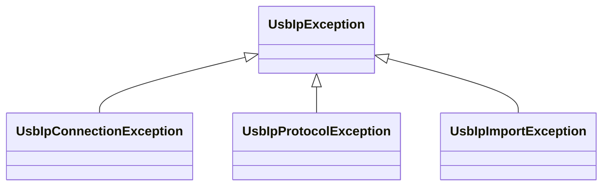

| 分類 | 表現 | 発生箇所 |
| --- | --- | --- |
| トランスポート障害（切断/リセット/タイムアウト/途中EOF） | `UsbIpConnectionException` ＋ 全保留転送を fail | 受信ポンプ・送信 |
| プロトコル違反（version不一致/未知op/長さ不整合/巨大フレーム） | `UsbIpProtocolException` | コーデック |
| import 失敗（OP_REP_IMPORT.status≠0） | `UsbIpImportException` | ImportAsync |
| USB 結果（STALL=-EPIPE 等） | `UsbTransferResult.Status`（例外にしない） | 完了ディスパッチ |
| 取消 | `OperationCanceledException` ＋ CMD_UNLINK | SubmitAsync(ct) |
| 状態/資源（Dispose後/閉鎖後/満杯/INバッファ不足） | `ObjectDisposedException`/`InvalidOperationException`/満杯=NAK | 各 API |
| デバイス役ハンドラの例外 | 既定で STALL 返却＋記録（方針は設定可） | server ディスパッチ |

USB status（errno）対応（抜粋）:

| errno | 値 | 意味 | ライブラリ表現 |
| --- | --- | --- | --- |
| 0 | 0 | 成功 | Ok |
| -EPIPE | -32 | STALL | Stall |
| -EOVERFLOW | -75 | babble/overflow | Overflow |
| -ETIMEDOUT | -110 | タイムアウト | TimedOut |
| -ENODEV | -19 | デバイス消失 | NoDevice |
| -EREMOTEIO | -121 | SHORT_NOT_OK 時の短小転送 | ShortRead |
| -ECONNRESET | -104 | UNLINK による取消 | Cancelled |

取消（Unlink）の意味論: `Unlink(seqnum)` は CMD_UNLINK を送る。成功（RET_UNLINK status=-ECONNRESET）なら対象 seqnum の保留エントリを「取消完了」として閉じ、対応する RET_SUBMIT は待たない。既に RET_SUBMIT 済みなら RET_UNLINK status=0 となり、通常完了として扱う。

---

## L3 オブジェクトモデル（任意）

ディスクリプタやエンドポイント設定を扱いたい「CPU 以外の利用」向けの利便層。コア（L1+L2）に依存し、未参照ならトリミングで除去される。

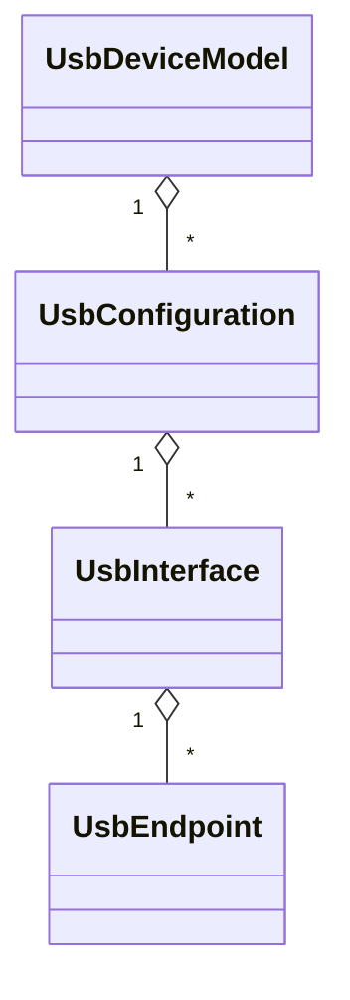

---

## 性能・非機能

USB は大量データをやり取りするため、頻繁に実行される箇所はゼロアロケーションとコピー最小化を両立する。

| 箇所 | 手法 |
| --- | --- |
| ヘッダ符号化/復号 | readonly struct ＋ `BinaryPrimitives`（BE）・スタック上 |
| 受信ペイロード | 呼び出し側所有バッファへ直書き（コピー 1 回） |
| 送信ペイロード | 呼び出し側 `ReadOnlyMemory` をそのまま write（必要に応じヘッダ+本体のベクタード送信を検討） |
| 完了通知 | コールバック interface（割込み直結）/ プールした `IValueTaskSource`（async もゼロアロ） |
| バッファ管理 | コアは保持しない。小ヘッダバッファは再利用、`ArrayPool` 併用は呼出側裁量 |

検証は `UsbIpDotnet.Benchmarks`（BenchmarkDotNet・`[MemoryDiagnoser]`）でホットパスのアロケーション 0 とスループットを継続計測する。

---

## テスト戦略

2 つのテストプロジェクトに分離し、双方を自動実行する。

- `UsbIpDotnet.UnitTest`（**標準系・どこでも常時**）: 単体（コーデックの BE 往復、部分受信、不正フレームの堅牢性、property based）＋プロセス内 lib↔lib 結合（`InMemoryUsbIpTransport` ＋手動ポンプで列挙/各転送/UNLINK/STALL/切断を決定論的に網羅）。外部依存なし。
- `UsbIpDotnet.E2ETest`（**usbip 環境要・実装間相互運用**）: 実カーネル＋docker。環境検出で自動 skip（`Xunit.SkippableFact` の `Skip.If(!UsbipEnvironment.IsAvailable, …)` または `[InteropFact]` ＋ `[Trait("Category","Interop")]`）。

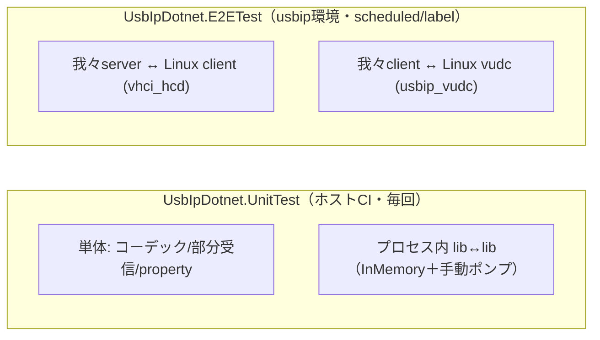

GitHub ホストランナーは usbip カーネルモジュール（`vhci_hcd`/`usbip_vudc`）をロードできない（`modprobe` 不可）ため、Tier B は**実カーネルを持つ環境（自前機 + docker、または usbip 対応カーネルの VM）**で実行する。docker はカーネルを共有するので、ホスト実機側にモジュールがロードされている前提で、コンテナは usbipd/usbip-utils 等のユーザ空間 peer とハーネスを再現可能に同梱する。

| テスト種別 | 環境 | 自動化 | skip 条件 |
| --- | --- | --- | --- |
| 単体 | 任意 | ホストCI 毎回 | なし |
| プロセス内結合 | 任意 | ホストCI 毎回 | なし |
| 実装間 E2E（両方向） | 実カーネル+docker | 自前ランナー/VM・scheduled | usbip 環境未検出時 skip |

参考: usbip カーネルモジュール — `vhci_hcd`（client側・attach、我々 server の検証用）、`usbip_host`（実デバイス export）、`usbip_vudc`（仮想デバイスコントローラ、我々 client の検証用）。

---

## ビルド / 配布

| 項目 | 内容 |
| --- | --- |
| TFM | `net10.0` 単一（最新 LTS・C# 14） |
| プラットフォーム | クロス OS（.NET 10 ランタイム） |
| パッケージ | 単一 NuGet `UsbIpDotnet`（コア L1+L2＋任意 L3 同梱） |
| 依存 | 追加依存を最小化（BCL のみを基本。テストは Xunit/SkippableFact/BenchmarkDotNet） |
| トリミング/AOT | トリミング対応設計。未参照 L3 は除去可 |

---

## 統合ガイド（統合者向け）

仮想CPU のレジスタモデルと URB の相互変換は統合者の薄いアダプタが担う。

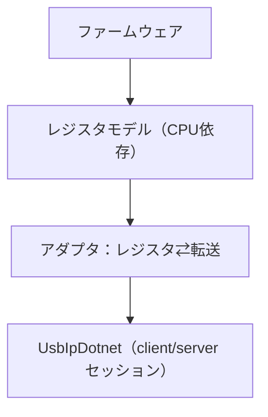

例: Renesas RX のレジスタ操作と URB/ライブラリ API の対応。

| RX レジスタ操作 | USB/IP・ライブラリ上の意味 |
| --- | --- |
| `USBREQ/USBVAL/USBINDX/USBLENG` | URB の setup[8]（ep0 制御時） |
| `PIPExCTR.PID=BUF` ＋ FIFO 読書 | URB の方向・transfer_buffer・length（Submit / RespondIn） |
| `DCPCTR.SUREQ`（ホスト） | 制御転送の SETUP ステージ開始 |
| `DCPCTR.CCPL` | 制御転送のステータス完了（CompleteControl） |
| `PID=STALL` / 受信 STALL | `Status = Stall`（-EPIPE） |
| `NRDY`（NAK） | 保留表満杯時の Submit=false／再送 |
| `BRDY`/`BEMP` ＋ `DTLN` | 転送完了・actual_length（OnTransferCompleted） |
| `SQSET/SQCLR/SQMON` | データトグル（多くは server 側で隠蔽） |

---

## 付録

### 用語

| 用語 | 意味 |
| --- | --- |
| URB | USB Request Block。転送 1 件の単位 |
| client | usbip でデバイスを import する側＝USBホスト相当 |
| server | usbip でデバイスを export する側＝USBデバイス相当 |
| DCP | Default Control Pipe（ep0） |
| seqnum | 要求と応答を対応づける連番（client が採番） |
| devid | リモートデバイス識別子 `(busnum<<16)\|devnum` |
| ポンプ | フレームを読み解釈しディスパッチする整形ループ |
| アダプタ | レジスタ⇄転送を変換する統合者側コード |

### 参考

- USB/IP protocol（Linux Kernel ドキュメント）: https://docs.kernel.org/usb/usbip_protocol.html
- protocol version: v1.1.1（ヘッダ表現 `0x0111`）

### 未決・要確認事項（執筆者メモ）

- `UsbIpDeviceInfo` の具体フィールド（usbip_usb_device の C# 表現）と DEVLIST の確保方針。
- speed の列挙（low/full/high/wireless/super）の正確なマッピング。
- transfer_flags の取り扱い（どこまで公開し、どこまで内部で正規化するか）。
- 所有ループ時の `Post` ヘルパを提供するか否か。
- L3 オブジェクトモデルの API 詳細（本リリース範囲か次版か）。
